# Plot Fig 图文使用手册

10 个大章、65 个小节，包含 21 个绘图教程、6 个批量教程和 231 项功能说明。

[下载完整离线手册](Plot_Fig-user-manual.zip)：解压后双击 `index.html`；也可克隆仓库后直接打开本目录中的 `index.html`。GitHub 中的 HTML 文件显示为源码，下面提供在线阅读内容。

## 大章目录

- [第 1 章 快速入门与操作基础](#chapter-1)
- [第 2 章 数据导入、整理与绑定](#chapter-2)
- [第 3 章 基础图型绘制教程](#chapter-3)
- [第 4 章 热图、矩阵与等值线](#chapter-4)
- [第 5 章 多轴图、图层与页面布局](#chapter-5)
- [第 6 章 曲线样式、标注与分组堆叠](#chapter-6)
- [第 7 章 坐标轴、尺度与参考线](#chapter-7)
- [第 8 章 模板复用、批量绘图与导出](#chapter-8)
- [第 9 章 项目保存、恢复与故障处理](#chapter-9)
- [第 10 章 附录：示例、边界与功能索引](#chapter-10)

<a name="top"></a>

## 阅读路线与章节导航

按“准备数据 → 绘制图形 → 调整属性 → 批量输出 → 保存恢复”的工作顺序阅读。首次使用从第 1、2 章开始；按图型查第 3–5 章；参数设置查第 6、7 章；系列出图查第 8 章；保存与排错查第 9 章。

[第 1 章　快速入门与操作基础5 个小节](#chapter-1)[第 2 章　数据导入、整理与绑定3 个小节](#chapter-2)[第 3 章　基础图型绘制教程12 个小节](#chapter-3)[第 4 章　热图、矩阵与等值线9 个小节](#chapter-4)[第 5 章　多轴图、图层与页面布局7 个小节](#chapter-5)[第 6 章　曲线样式、标注与分组堆叠10 个小节](#chapter-6)[第 7 章　坐标轴、尺度与参考线4 个小节](#chapter-7)[第 8 章　模板复用、批量绘图与导出10 个小节](#chapter-8)[第 9 章　项目保存、恢复与故障处理3 个小节](#chapter-9)[第 10 章　附录：示例、边界与功能索引2 个小节](#chapter-10)

导入数据 → 绑定列 → 生成/应用 → 调整样式 → 保存项目 → 导出图片

在线版使用大章目录和各章小节目录跳转；Ctrl+F 搜索全文。离线 HTML 版另有可折叠侧栏，保留整个文件夹即可阅读。

**常用术语与三个批量入口**

| 名称 | 本手册用法 |
| --- | --- |
| 图页 | 导出图形的整体页面，具有物理宽高。 |
| 图层 | 图页内承载坐标轴、曲线及相关对象的区域。 |
| 曲线 | 一个绘图系列；在柱图、箱线图等图型中也使用界面的这一名称。 |
| 批量选 Y | 从一张表选择多个 Y，生成同图多条曲线。 |
| 数据表批绘 | 对多张数据表复用当前图形或模板，生成独立结果。 |
| 逐图层导出 | 将当前图页的选中图层分别输出。 |
| 项目文件 | 保存图形、数据与绑定的 .plotfig.json 文件。 |
| 模板 | 用于复用结构或样式的配置，区别于完整工作区项目。 |

<a name="chapter-1"></a>

CHAPTER 01 · 5 个小节

## 第 1 章　快速入门与操作基础

先了解工作区和修改生效规则，再完成第一张双曲线图。本章帮助你选对图型，并掌握缩放、撤销与快捷操作。

学习目标：完成后，你应能导入示例、生成图形，并区分未应用设置与已应用结果。

**本章小节目录**

- [1.1 开始使用与环境准备](#s01)
- [1.2 工作区导览与操作生效规则](#s02)
- [1.3 十分钟完成第一张双曲线图](#s03)
- [1.4 图表类型选择与数据组织](#s07)
- [1.5 画布缩放、撤销重做与快捷键](#s18)

<a name="s01"></a>

### 1.1 开始使用与环境准备

Plot Fig 是本地科研绘图工作台：将表格中的列绑定到图形对象，调整外观与坐标轴，保存可编辑项目，再导出 SVG 或 PNG。本手册面向当前工作区的可用功能；界面核对日期为 2026 年 10 月 8 日，图形 Schema 为 1.24.0，工作区项目格式为 2.0.0。

> 直接双击本文件夹的 index.html 阅读。目录可跳转，浏览器 Ctrl+F 可搜索全文；图片与示例均为本地文件，整文件夹复制后仍可离线阅读。示例数据均为教学构造数据。

| 环境 | 要求与操作 |
| --- | --- |
| Node.js | 24.13.0 或更新版本；终端运行 node --version 检查。 |
| pnpm | 项目声明 11.19.0；运行 pnpm --version 检查。 |
| 浏览器 | 使用支持现代 Web API 的浏览器；图像生成与普通数据处理在浏览器中进行。 |
| 可选 Origin | 仅导入原生 OTP/OTPU 模板时需要 Windows 与能正常启动的本机 Origin。 |

1. 进入项目根目录。Windows 可双击 `start-plot-fig.cmd`，脚本检查环境、按锁文件安装依赖并打开浏览器。
2. 也可按下面命令启动；以终端实际输出的地址为准。首次安装依赖需要可访问依赖源。
3. 保持服务终端运行；完成工作并下载项目后，按 Ctrl+C 停止服务。

```text
npm install --global pnpm@11.19.0
pnpm install --frozen-lockfile
pnpm --filter @plot-fig/web-editor dev --host 127.0.0.1 --port 5173
```

Windows 脚本参数：`.\start-plot-fig.cmd --check` 只检查环境并安装依赖；`.\start-plot-fig.cmd --no-open` 启动而不自动打开浏览器。常用访问地址为 `http://127.0.0.1:5173`。

<a name="s02"></a>

### 1.2 工作区导览与操作生效规则

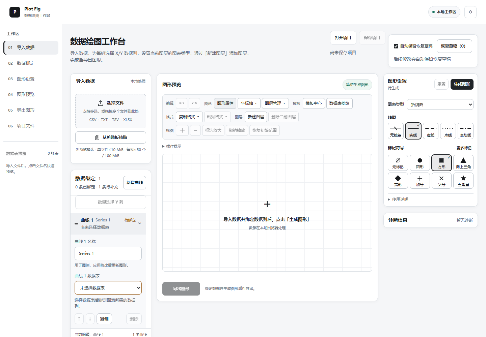

图 1.1　初始工作区：左侧导航与数据表，中间数据绑定和图形预览，右侧绘图设置与诊断

| 区域 | 用途 |
| --- | --- |
| 项目文件 | 打开项目、保存项目、自动保留恢复草稿、恢复已有副本。 |
| 导入数据 | 文件选择、拖入文件、粘贴文本；导入后使用“追加数据”。 |
| 数据表预览 | 查看已导入文件、数据行列、列设置与表名称。 |
| 数据绑定 | 一条曲线对应一组数据角色；不同曲线可来自不同表。 |
| 图形设置 | 切换当前图层的图表类型、线型和标记；生成图形或应用修改。 |
| 预览工具栏 | 编辑、图形、模板、格式、图层、视图六组入口。 |
| 诊断信息 | 显示绑定、数据、范围、布局等问题；按提示修正。 |

#### 先区分四种对象

数据表保存观测值；曲线保存列绑定与绘制外观；图层容纳曲线、坐标轴和布局；图页容纳所有图层及页级文字和注释。一个项目同时保存图页、数据表和绑定。删除数据表、删除曲线、删除图层是不同操作。

#### 改完设置，何时会出现在图片中

1. 导入、改绑定、改图表类型属于待绘图设置。首次点击“生成图形”，后续点击“应用修改”；“重置待绘图设置”放弃这一批尚未应用的更改。
2. 属性窗口中的“应用”提交并留在窗口，“确定”提交后关闭，“取消”放弃尚未应用部分。已经点击“应用”的修改可用全局撤销恢复。
3. 检查“预览已更新”与诊断信息，然后保存项目或导出。下载文件、自动恢复和批绘主要围绕已应用状态工作。

> 菜单或按钮变灰通常表示当前对象、图型或状态不适用。属性对象树选中谁，就编辑谁；不要仅凭页签名称判断修改范围。

<a name="s03"></a>

### 1.3 十分钟完成第一张双曲线图

目标：使用随附的 [01-xy.csv](examples/01-xy.csv)，以 Time_s 为共同 X，以 Sample_A、Sample_B 为两个 Y。Error_A 与 Temperature 留作进阶练习。

1. 启动编辑器，选择文件 01-xy.csv；或用文本编辑器打开它，复制全部内容后选择“从剪贴板粘贴”→“预览文本”。
2. 确认表头行为 1、单位行为 0、数据起始行为 2。预览应为 5 列、7 个数据行，点击“确认导入”。
3. 检查第一条曲线 X=Time_s、Y=Sample_A。点击“批量选择 Y 列”，共用 X 选择 Time_s，只勾选 Sample_A 与 Sample_B，点击“添加所选曲线”。已有相同绑定会跳过。
4. 图表类型选择“折线图”，线型选择“实线”，符号选择“方形”，点击“生成图形”。
5. 应看到两条曲线：Sample_A 从 0.2 增至 3.1，Sample_B 从 0.3 增至 2.7。若没有图，检查绑定和诊断，再应用。
6. 点击“图形属性”，选择曲线，调整颜色或线宽并确定。点击“保存项目”下载 .plotfig.json。最后打开“导出图形”，预览后导出 PNG 或 SVG。

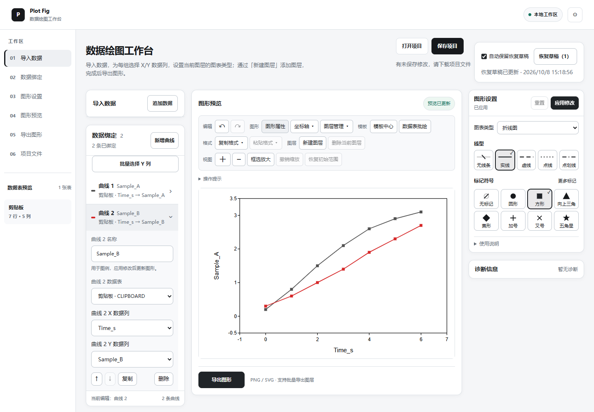

图 1.2　按本章数据实际生成的双曲线图；截图采用粘贴导入，因此表名为“剪贴板”

> 导入文件时表名通常来自文件名；粘贴时表名为“剪贴板”，不影响数据列绑定。教程截图使用同一套教学数据。

<a name="s07"></a>

### 1.4 图表类型选择与数据组织

入口：右侧图形设置 → 图表类型。切换类型可能改变所需数据角色；切换后重新检查绑定，再应用。线加符号通过折线加标记组合得到。

| 图型 | 数据角色 | 适合的操作 |
| --- | --- | --- |
| 折线 / 散点 / 线加符号 | X、Y；可选误差和映射列 | 趋势、相关性；无线条+标记即点图，实线+标记即线加符号。 |
| 柱形 / 堆叠柱形 | 类别、数值；可选误差 | 离散组比较；可切换方向、间距、重叠与基线。 |
| 直方图 | 一列样本值 | 选择分箱方法与归一化，查看分布。 |
| 箱线图 | 样本值；可选分组、分裂分组 | 比较分布、离群点、均值/中位数。 |
| 面积图 | X、Y | 设置填充、基线或曲线间填充。 |
| 热力图 | X、Y、Z，或宽表矩阵入口 | 用颜色表达强度；确认坐标和色标。 |
| 等值线图 | 完整、等间距 X/Y/Z 网格 | 设置等值线级别、填色、线与标签。 |
| 双 / 三 / 四纵轴 | 多组 X/Y 绑定 | 不同量级的数据共享图页；明确各曲线的 Y 轴。 |
| 上下共享横轴 | 多组 X/Y，分层显示 | 横轴对齐而纵轴分别呈现。 |

> 同一图层的图表类型设置会统一该层的绘图类型。多纵轴和共享 X 是结构预设，并非新数据格式。灰色“分格”等保留入口不代表功能已实现。

<a name="s18"></a>

### 1.5 画布缩放、撤销重做与快捷键

| 操作 | 作用与前提 |
| --- | --- |
| 滚轮 | 绘图区内缩放 X；Shift+滚轮缩放 Y；Ctrl/⌘+滚轮双轴缩放；位于轴上时仅缩放该轴。 |
| 放大 / 缩小 | 使用预览工具栏按钮调整可见数据范围。 |
| 框选放大 | 启用后拖矩形；Esc 退出。锁定数据比例时先检查该约束。 |
| + / − | 绘图区获得焦点后缩放。 |
| Alt+Backspace / Home | 绘图区内撤销缩放 / 恢复本轮初始范围。 |
| Ctrl/⌘+Z | 撤销已应用工作区修改；输入框内保留文本本身的撤销。 |
| Ctrl/⌘+Y 或 Ctrl/⌘+Shift+Z | 重做工作区修改。 |
| Ctrl+O / Ctrl+S | 打开 / 保存项目；输入框与弹窗状态可能阻止快捷命令。 |
| Ctrl+G / F2 / F12 | 导出 / 图页属性 / 图层内容；在合适的图形上下文中使用。 |
| Enter / Esc / Ctrl+Enter | 原位编辑中提交 / 取消 / 提交多行图例。 |

全局历史通常每次生成、应用、确定记录一步；连续滚轮会合并事务。历史最多 100 步，并按共享对象估算控制在 64 MiB，超预算淘汰最早记录；单步过大可能无法撤销但保留当前结果。打开项目清空历史，撤销后进行新修改会清除重做分支。

> 缩放改变轴范围，会进入项目与导出，原始数据不变。“撤销缩放”只对应当前缩放会话；全局撤销可恢复图形、数据、绑定与范围。有属性窗口或待绘图设置时先应用或取消，再使用全局历史。分类图的恢复初始范围不一定等于显示全部类别，显示全部可用轴属性的恢复自动范围。

<a name="chapter-2"></a>

CHAPTER 02 · 3 个小节

## 第 2 章　数据导入、整理与绑定

绘图之前先确认表格被正确解析：列名、类型、单位和缺失值决定后续绑定是否有效。按导入、检查、绑定的顺序阅读。

学习目标：完成后，每条曲线的 X、Y 或其他必需角色都应指向正确的数据表与列。

**本章小节目录**

- [2.1 导入文件、粘贴文本与批量导入](#s04)
- [2.2 数据表管理、列类型与缺失值](#s05)
- [2.3 曲线绑定、跨表曲线与批量选择 Y](#s06)

<a name="s04"></a>

### 2.1 导入文件、粘贴文本与批量导入

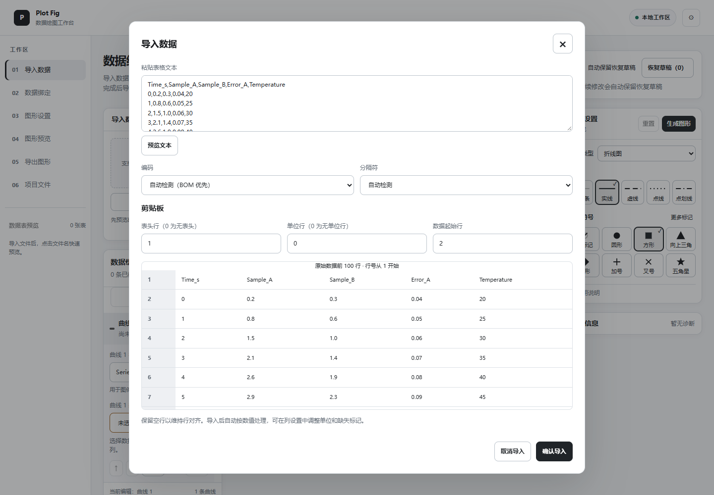

图 2.1　导入预览：检查分隔符、表头和数据起始行后确认

| 输入方式 | 使用方法 |
| --- | --- |
| CSV / TSV / TXT | 选择文件或拖入；自动识别编码、分隔符。乱码时改 UTF-8、GB18030 或 UTF-16 LE；挤成一列时改逗号、Tab、分号或连续空格。 |
| XLSX | 选择工作簿，勾选要导入的工作表；可只选部分工作表。 |
| 粘贴表格 | 从 Excel 复制含表头区域，粘贴后先“预览文本”；确认分列正确再导入。 |
| 多个文件 | 文件选择中按 Ctrl/Shift 多选，或一次拖入多个文件。支持混合文本与 XLSX。 |

#### 行设置

| 字段 | 含义 | 示例 |
| --- | --- | --- |
| 表头行 | 从 1 开始；0 表示没有表头 | 第一行为名称时填 1 |
| 单位行 | 独立单位行；0 表示无单位行 | 第二行为 s、MPa 等时填 2 |
| 数据起始行 | 从该原始文件行开始读取观测值 | 只有一行表头填 2；有表头和单位行填 3 |

#### 多文件导入步骤

1. 选择多文件后，逐文件检查成功或失败状态。默认勾选各文件的第一张表；Excel 可追加其他工作表。
2. 点击对应预览，分别调整表头、单位行和数据起始行。编码与分隔符作用于整批文本文件，修改会重新读取并重置表选择和行设置。
3. 取消导入不会追加数据。确认后数据进入待绘图设置；检查绑定，再生成图形或应用修改。

> 单文件最多 10 MiB；每批最多 50 个文件、合计 100 MiB。损坏或不支持的文件会列出原因，有效表仍可导入。同名文件会分别追加；应用整批后可一步撤销。导入预览只展示部分行，不等于只导入这些行。

<a name="s05"></a>

### 2.2 数据表管理、列类型与缺失值

1. 点击左侧表名或“数据表预览”，切换“当前数据表”，核对行列数。
2. 修改“表名称”后点击“重命名”；需要重新解释文件行结构时用“调整导入参数”。
3. 点击列头的“设置…列”，修改列名、类型、单位与缺失标记，检查转换结果后点击“应用列设置”。
4. 移除表之前检查引用它的曲线；按删除窗口提供的处理选项操作，再核对诊断。

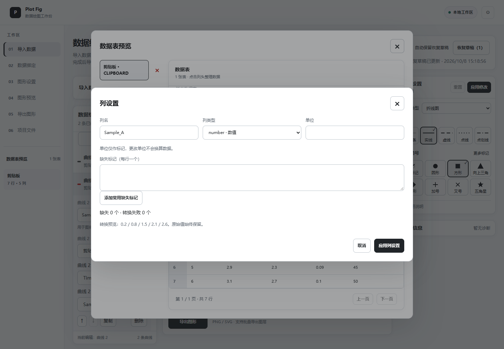

图 2.2　列设置：数值类型、单位、缺失标记及转换预览

| 列类型 | 用途 |
| --- | --- |
| 数值 number | 曲线 Y、误差、强度 Z、大小/颜色连续映射。 |
| 文本 string | 文字标签、非数值字段。 |
| 分类 category | 柱图类别、分组等离散字段。 |
| 日期 date / 日期时间 datetime | 连续时间 X 轴；配合日历刻度使用。 |

单位是说明性元数据，改变单位文字不会把 m 自动换算成 mm。缺失标记每行一个；可添加常用标记后按本表情况修改。数字中含单位文字、千位符或混用格式时，要看转换失败数量，必要时先整理原始文件。

> 表格预览用于查看和配置数据，并非完整 Excel 单元格编辑器。保留原始数据文件；需批量改数值时，通常在源表中处理后重新导入。工作区最多 1,000,000 单元格，单表处理还受 100,000 行、256 列限制。

<a name="s06"></a>

### 2.3 曲线绑定、跨表曲线与批量选择 Y

入口：数据绑定。先选数据表，再选当前图型所需角色；自动匹配只是起点，最终以列名和单位核对。展开某条曲线后可修改名称、数据表、列、顺序，或复制、删除该曲线。

| 操作 | 具体用途 |
| --- | --- |
| 新增曲线 | 在当前图层增加一条独立曲线，再设置数据表和 X/Y。 |
| 复制曲线 | 复制现有配置后改 Y 或数据表；检查是否意外绘制同一列。 |
| 上移 / 下移 | 改变曲线顺序与绘制层次；不改变原始数据行。 |
| 跨表绘图 | 不同曲线选择不同数据表。保持坐标含义一致，否则考虑不同轴或图层。 |
| 曲线名称 | 用于图例；修改后应用才更新图形。 |

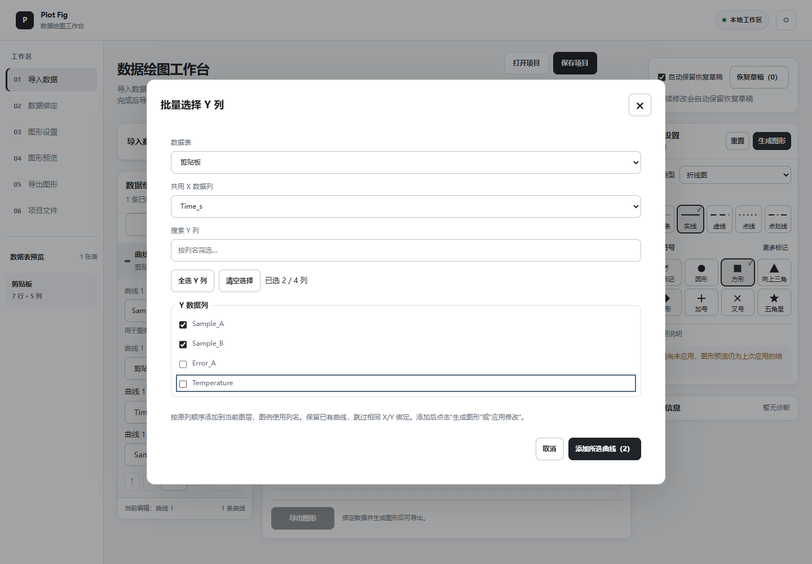

图 2.3　批量选择 Y 列：本例只勾选 Sample_A 与 Sample_B

1. 导入多个数值 Y 列的数据表，点击“批量选择 Y 列”。
2. 选择共用 X，使用搜索、全选 Y 列或清空选择定位目标。X 不列入 Y 候选；误差列和温度列不要误当作主曲线。
3. 点击“添加所选曲线”，再生成图形或应用修改。曲线按原表列顺序添加，同轴相同 X/Y 绑定跳过。
4. 取消窗口不改变绑定；加入后尚未应用，可以“重置待绘图设置”撤回。

批量选 Y 支持折线、散点、柱形（含堆叠）与面积图。复杂图型请按其角色分别设置，不能把所有数值列一律当成 Y。

<a name="chapter-3"></a>

CHAPTER 03 · 12 个小节

## 第 3 章　基础图型绘制教程

从图型概览进入逐图实操。每个独立教程提供原始 CSV、列绑定、操作步骤、实际效果图及可重新打开的示例项目；最后查阅统计参数。

学习目标：完成后，用点数、柱高、频数或统计量核对结果，再保存项目和导出图片。

**本章小节目录**

- [3.1 柱图与统计图：概览及数据要求](#s12)
- [3.2 折线图](#s26)
- [3.3 散点图](#s27)
- [3.4 线加符号图](#s28)
- [3.5 分组柱形图](#s29)
- [3.6 水平条形图](#s30)
- [3.7 堆叠柱形图](#s31)
- [3.8 百分比堆叠柱形图](#s32)
- [3.9 直方图](#s33)
- [3.10 箱线图](#s34)
- [3.11 面积图](#s35)
- [3.12 直方图、箱线图与统计分布参数](#s57)

<a name="s12"></a>

### 3.1 柱图与统计图：概览及数据要求

#### 柱图与堆叠柱图

1. 导入 [02-category.csv](examples/02-category.csv)，选择柱形图，以 Group 为类别，以 A/B 为数值曲线。
2. 在柱图布局中设置方向、柱间距、重叠比例、基线与堆叠组；堆叠柱形可启用百分比。
3. 在外观中分别设置正负值填充、边框与透明度，在误差和数据标签页绑定并排版。

缺失类别可保留缺口或按零绘制，二者含义不同。分类轴缩放按类别窗口显示；范围 0–3 表示前三个类别，不是类别名字的数值范围。

#### 直方图

1. 导入 [03-distribution.csv](examples/03-distribution.csv)，类型选直方图，样本绑定 Value。
2. 在“分箱”中选择方式：自动、箱数、箱宽或显式边界等界面选项；填箱宽时同步检查起点、终点和边界包含规则。
3. 在统计与分布中选择归一化及统计标注；可叠加 Normal、Lognormal、Weibull、Exponential、Gamma、Laplace、Lorentz、KDE、Poisson、Binomial。参数按各分布定义填写。

> 分布叠加由所填参数或 KDE 设置生成，不能把一条叠加曲线直接当作已完成统计拟合或显著性检验。比较多组直方图时先统一分箱边界与归一化方式。

#### 箱线图

样本绑定 Value，分组绑定 Group；需要双重分组时再设置分裂分组。选择四分位算法、箱体范围、须规则（倍数/百分位等），开启均值、中位数、缺口或置信区间。原始点支持隐藏、确定性抖动、均匀散开；可显示离群与极端值、连接均值/中位数/百分位。报告结果时记录所用统计规则。

#### 面积图

绑定 X/Y，在面积图页设置基线、填充和轮廓；在偏移与填充中配置位置或同轴曲线间填充。需累计时在图层堆叠中选择成员。对交叉曲线、缺失点与非线性轴，应用后检查填充是否符合含义。

<a name="s26"></a>

### 3.2 折线图

本节从原始 CSV 开始完成绘图。练习时先保存当前工作，建议在新标签页从空白工作区开始，避免已有曲线和图层影响结果。

原始数据：[01-xy.csv](examples/01-xy.csv)。如需对照结果，可通过“打开项目”读取 [折线图示例项目](examples/projects/line.plotfig.json)。

| 角色 | 数据列 / 设置 |
| --- | --- |
| X | Time_s |
| Y | Sample_A、Sample_B |

1. 选择文件 01-xy.csv，表头行 1、单位行 0、数据起始行 2；确认导入后，核对数据列。
2. 图表类型选“折线图”。在第一条曲线中绑定 Time_s / Sample_A；新增曲线绑定 Time_s / Sample_B。也可批量选 Y。
3. 线型选实线，标记选“无标记”，得到纯折线。曲线名称可保留列名。
4. 点击“生成图形”或“应用修改”；打开图形属性完成细节调整，确定后保存项目，再导出图片。

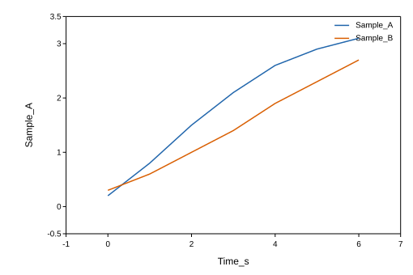

图 3.1　折线图结果示例：由当前 Plot Fig 渲染器和随附数据生成，颜色用于区分系列

#### 结果检查

两条折线各有 7 个数据点的位置；X 为 0–6，末点分别是 3.1 和 2.7。纯折线不显示点符号，但仍使用全部观测值。

#### 继续调整

| 参数 / 入口 | 如何使用 |
| --- | --- |
| 线条页 | 设置线宽、颜色、虚线、线端和拐角。 |
| 显示页 | 需要单调 X 连线时选 X 升序；往返扫描保持原始顺序。 |
| 缺失点 | 选跨过连接或在无效点处断开，按实验含义决定。 |

> “折线图”默认可带符号。要得到本节纯折线，必须明确选择无标记；没有点符号不表示数据已抽样。

<a name="s27"></a>

### 3.3 散点图

本节从原始 CSV 开始完成绘图。练习时先保存当前工作，建议在新标签页从空白工作区开始，避免已有曲线和图层影响结果。

原始数据：[01-xy.csv](examples/01-xy.csv)。如需对照结果，可通过“打开项目”读取 [散点图示例项目](examples/projects/scatter.plotfig.json)。

| 角色 | 数据列 / 设置 |
| --- | --- |
| X | Time_s |
| Y | Sample_A、Sample_B |

1. 选择文件 01-xy.csv，表头行 1、单位行 0、数据起始行 2；确认导入后，核对数据列。
2. 选择“散点图”，为两条曲线设置共同 X 与各自 Y。
3. 线型确认无线条，标记选圆形；图形属性 → 曲线 → 符号中将大小设为清晰可读的数值。
4. 点击“生成图形”或“应用修改”；打开图形属性完成细节调整，确定后保存项目，再导出图片。

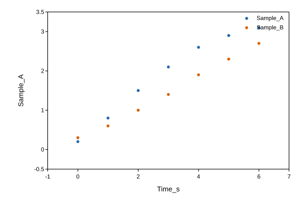

图 3.2　散点图结果示例：由当前 Plot Fig 渲染器和随附数据生成，颜色用于区分系列

#### 结果检查

每组显示 7 个点，组间颜色不同；点之间没有连接线。

#### 继续调整

| 参数 / 入口 | 如何使用 |
| --- | --- |
| 符号映射 | 启用颜色映射并选 Temperature，可让一条曲线内点随温度变色。 |
| 大小映射 | 选数值列，再选面积/直径随数值变化与最小/最大尺寸。 |
| 重合点 | 符号细节中展开重合数据点并标出真实位置。 |

> 不要为了让点更分散而修改原始数据。视觉展开功能的位移不是真实测量坐标。

<a name="s28"></a>

### 3.4 线加符号图

本节从原始 CSV 开始完成绘图。练习时先保存当前工作，建议在新标签页从空白工作区开始，避免已有曲线和图层影响结果。

原始数据：[01-xy.csv](examples/01-xy.csv)。如需对照结果，可通过“打开项目”读取 [线加符号图示例项目](examples/projects/line-symbol.plotfig.json)。

| 角色 | 数据列 / 设置 |
| --- | --- |
| X | Time_s |
| Y | Sample_A、Sample_B |

1. 选择文件 01-xy.csv，表头行 1、单位行 0、数据起始行 2；确认导入后，核对数据列。
2. 选择折线图，线型选择实线，标记选择圆形或方形。
3. 绑定两条曲线后，分别在线条与符号页设置颜色、线宽、大小和填充。
4. 点击“生成图形”或“应用修改”；打开图形属性完成细节调整，确定后保存项目，再导出图片。

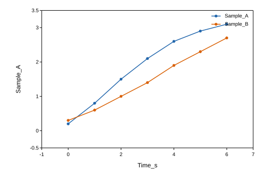

图 3.3　线加符号图结果示例：由当前 Plot Fig 渲染器和随附数据生成，颜色用于区分系列

#### 结果检查

每条曲线既有连接线，也有 7 个标记。示例 SVG 用圆形，首次快速教程用方形，两者是同一图型的符号变体。

#### 继续调整

| 参数 / 入口 | 如何使用 |
| --- | --- |
| 空心点 | 将符号填充设为无，保留有色边框。 |
| 符号周围留白 | 在线条页启用，减少线穿过符号的视觉干扰。 |
| 线条绘制在符号前方 | 开启会改变遮挡关系，检查粗线是否盖住点。 |

> 线加符号不是图表类型下拉框的独立项，通过线型和标记组合得到。

<a name="s29"></a>

### 3.5 分组柱形图

本节从原始 CSV 开始完成绘图。练习时先保存当前工作，建议在新标签页从空白工作区开始，避免已有曲线和图层影响结果。

原始数据：[02-category.csv](examples/02-category.csv)。如需对照结果，可通过“打开项目”读取 [分组柱形图示例项目](examples/projects/bar.plotfig.json)。

| 角色 | 数据列 / 设置 |
| --- | --- |
| 类别 | Group |
| 数值系列 1 / 2 | A / B |

1. 选择文件 02-category.csv，表头行 1、单位行 0、数据起始行 2；确认导入后，核对数据列。
2. 图表类型选柱形图，绑定类别 Group、数值 A。
3. 新增曲线，类别仍为 Group，数值改为 B；切勿把 Error 也作为第三组柱。
4. 图形属性 → 曲线 → 柱图布局，方向选竖向，检查柱间距与重叠比例。
5. 点击“生成图形”或“应用修改”；打开图形属性完成细节调整，确定后保存项目，再导出图片。

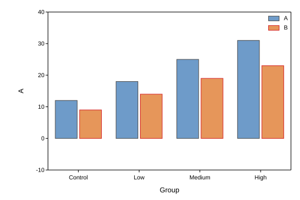

图 3.4　分组柱形图结果示例：由当前 Plot Fig 渲染器和随附数据生成，颜色用于区分系列

#### 结果检查

Control、Low、Medium、High 四类，每类两根柱；High 的 A/B 分别为 31/23。

#### 继续调整

| 参数 / 入口 | 如何使用 |
| --- | --- |
| 柱间距 / 重叠 | 小间距适合密集比较；重叠过大会遮住后方系列。 |
| 正负值外观 | 分别设置填充、边框与透明度。 |
| 误差 | 值误差模式选对称，误差数据列绑定 Error。 |

> 同一系列内类别应能唯一定位。重复类别通常不是自动求和请求，应先整理数据。

<a name="s30"></a>

### 3.6 水平条形图

本节从原始 CSV 开始完成绘图。练习时先保存当前工作，建议在新标签页从空白工作区开始，避免已有曲线和图层影响结果。

原始数据：[02-category.csv](examples/02-category.csv)。如需对照结果，可通过“打开项目”读取 [水平条形图示例项目](examples/projects/bar-horizontal.plotfig.json)。

| 角色 | 数据列 / 设置 |
| --- | --- |
| 类别 | Group |
| 数值 | A、B |

1. 选择文件 02-category.csv，表头行 1、单位行 0、数据起始行 2；确认导入后，核对数据列。
2. 先按分组柱形图绑定两个系列。
3. 图形属性 → 选择柱图曲线 → 柱图布局，将方向设为水平；其他系列也设成水平。
4. 检查类别轴位于 Y 方向，数值长度沿 X 方向；调整两轴标题。
5. 点击“生成图形”或“应用修改”；打开图形属性完成细节调整，确定后保存项目，再导出图片。

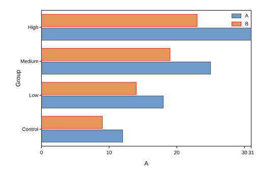

图 3.5　水平条形图结果示例：由当前 Plot Fig 渲染器和随附数据生成，颜色用于区分系列

#### 结果检查

四个类别纵向排列，每类两根水平条；条长对应 A/B 数值。

#### 继续调整

| 参数 / 入口 | 如何使用 |
| --- | --- |
| 类别顺序 | 轴高级分类顺序可设首次出现、升序、降序或指定顺序。 |
| 标签 | 根据条形方向选择合适的标签位置，避免把长文字放在狭窄条内。 |

> 示例项目优先展示几何结果；改变方向后务必按实际量纲重命名坐标轴，不能只交换视觉方向。

<a name="s31"></a>

### 3.7 堆叠柱形图

本节从原始 CSV 开始完成绘图。练习时先保存当前工作，建议在新标签页从空白工作区开始，避免已有曲线和图层影响结果。

原始数据：[02-category.csv](examples/02-category.csv)。如需对照结果，可通过“打开项目”读取 [堆叠柱形图示例项目](examples/projects/stacked-bar.plotfig.json)。

| 角色 | 数据列 / 设置 |
| --- | --- |
| 类别 | Group |
| 堆叠系列 | A、B；同一堆叠组 |

1. 选择文件 02-category.csv，表头行 1、单位行 0、数据起始行 2；确认导入后，核对数据列。
2. 选择堆叠柱形图，先绑定 Group / A，再新增 Group / B。
3. 在柱图布局确认两个系列属于同一堆叠组，百分比选项关闭。
4. 按需要到图层 → 堆叠启用总标签，修改颜色和字号。
5. 点击“生成图形”或“应用修改”；打开图形属性完成细节调整，确定后保存项目，再导出图片。

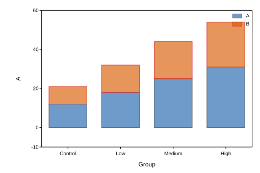

图 3.6　堆叠柱形图结果示例：由当前 Plot Fig 渲染器和随附数据生成，颜色用于区分系列

#### 结果检查

每类显示两段累计高度：Control=21，Low=32，Medium=44，High=54。

#### 继续调整

| 参数 / 入口 | 如何使用 |
| --- | --- |
| 堆叠组 | 相同组累计；不同组的分组关系需检查预览。 |
| 排序 | 图层堆叠可按大小排序，选择升/降序。 |
| 总标签 | 显示各类别总量；普通数据标签用于单段数值。 |

> 堆叠适合可相加的量。同一图中混合单位或不可相加的百分率不应简单堆叠。

<a name="s32"></a>

### 3.8 百分比堆叠柱形图

本节从原始 CSV 开始完成绘图。练习时先保存当前工作，建议在新标签页从空白工作区开始，避免已有曲线和图层影响结果。

原始数据：[02-category.csv](examples/02-category.csv)。如需对照结果，可通过“打开项目”读取 [百分比堆叠柱形图示例项目](examples/projects/percent-bar.plotfig.json)。

| 角色 | 数据列 / 设置 |
| --- | --- |
| 类别 | Group |
| 原始值 | A、B，保持原值 |

1. 选择文件 02-category.csv，表头行 1、单位行 0、数据起始行 2；确认导入后，核对数据列。
2. 按上一节生成堆叠柱图。
3. 柱图布局启用百分比堆叠，或在相应图层堆叠模式启用百分比归一化。
4. 将数值轴标题手动改为占比（%），检查标签显示原值还是百分比，按展示目的设置。
5. 点击“生成图形”或“应用修改”；打开图形属性完成细节调整，确定后保存项目，再导出图片。

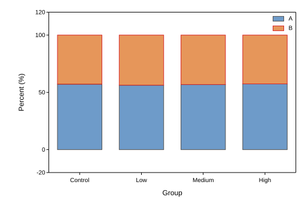

图 3.7　百分比堆叠柱形图结果示例：由当前 Plot Fig 渲染器和随附数据生成，颜色用于区分系列

#### 结果检查

正值样本每类总高为 100；High 中 A 占约 57.41%，B 占约 42.59%。原始表仍为 31 与 23。

#### 继续调整

| 参数 / 入口 | 如何使用 |
| --- | --- |
| 统一范围 | 比较时可把数值轴固定在 0–100。 |
| 颜色 | 各类别中 A/B 必须使用相同系列颜色。 |

> 本例均为正值。含负数的数据需要另行解释正负堆叠规则，不能把本例的 100% 结论套到任意数据。

<a name="s33"></a>

### 3.9 直方图

本节从原始 CSV 开始完成绘图。练习时先保存当前工作，建议在新标签页从空白工作区开始，避免已有曲线和图层影响结果。

原始数据：[03-distribution.csv](examples/03-distribution.csv)。如需对照结果，可通过“打开项目”读取 [直方图示例项目](examples/projects/histogram.plotfig.json)。

| 角色 | 数据列 / 设置 |
| --- | --- |
| 样本 | Value |
| Group | 本节不绑定；24 个样本一起统计 |

1. 选择文件 03-distribution.csv，表头行 1、单位行 0、数据起始行 2；确认导入后，核对数据列。
2. 图表类型选直方图，样本列绑定 Value。
3. 图形属性 → 分箱，首次使用自动分箱；需要可重复比较时改显式边界或相同箱宽。
4. 统计与分布中归一化选频数，检查是否需要统计标注。
5. 点击“生成图形”或“应用修改”；打开图形属性完成细节调整，确定后保存项目，再导出图片。

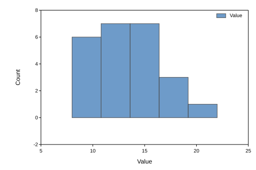

图 3.8　直方图结果示例：由当前 Plot Fig 渲染器和随附数据生成，颜色用于区分系列

#### 结果检查

24 个样本值从 8 到 22；频数模式下全部箱计数合计 24。更改分箱后柱数会变化，原始样本数不变。

#### 继续调整

| 参数 / 入口 | 如何使用 |
| --- | --- |
| 分箱 | 可选自动、固定箱数、箱宽、显式边界；边界应覆盖全部目标数据。 |
| 边界包含 | 核对等于边界的样本落入左箱还是右箱。 |
| 分布叠加 | 选 KDE 或指定分布、归一化和参数；KDE 可配置带宽。 |

> Group 是说明列，本节合并两组画一个总体直方图。按组单独比较需准备分别筛选后的样本列/表并新增曲线。

<a name="s34"></a>

### 3.10 箱线图

本节从原始 CSV 开始完成绘图。练习时先保存当前工作，建议在新标签页从空白工作区开始，避免已有曲线和图层影响结果。

原始数据：[03-distribution.csv](examples/03-distribution.csv)。如需对照结果，可通过“打开项目”读取 [箱线图示例项目](examples/projects/box.plotfig.json)。

| 角色 | 数据列 / 设置 |
| --- | --- |
| 样本值 | Value |
| 分组 | Group |
| 分裂分组 | 不绑定 |

1. 选择文件 03-distribution.csv，表头行 1、单位行 0、数据起始行 2；确认导入后，核对数据列。
2. 选择箱线图，样本列选 Value，分组列选 Group，分裂分组留空。
3. 箱体与须页选择四分位算法和须范围；本例保留默认 Type 7 与 1.5 IQR。
4. 原始点与百分位页可开启抖动/散开点，外观页区分均值、中位数、离群点。
5. 点击“生成图形”或“应用修改”；打开图形属性完成细节调整，确定后保存项目，再导出图片。

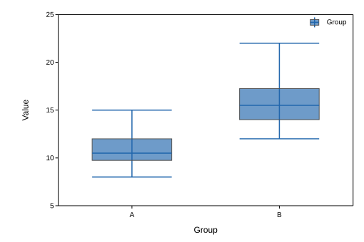

图 3.9　箱线图结果示例：由当前 Plot Fig 渲染器和随附数据生成，颜色用于区分系列

#### 结果检查

A、B 两个箱体，每组 12 个样本。A 中位数 10.5，B 中位数 15.5；算法与须规则影响箱体及离群点判定。

#### 继续调整

| 参数 / 入口 | 如何使用 |
| --- | --- |
| 箱体/须 | 可用四分位、标准差/标准误等配置依界面选项；记录实际规则。 |
| 连接线 | 可连接各组均值、中位数或指定百分位。 |
| 分布 | 叠加 KDE 并设置分布布局，形成分布轮廓；这不是独立的“小提琴”类型入口。 |

> 显示原始点的抖动是可视化排布，不改变样本值；不要把连接箱体均值当作原始逐点折线。

<a name="s35"></a>

### 3.11 面积图

本节从原始 CSV 开始完成绘图。练习时先保存当前工作，建议在新标签页从空白工作区开始，避免已有曲线和图层影响结果。

原始数据：[01-xy.csv](examples/01-xy.csv)。如需对照结果，可通过“打开项目”读取 [面积图示例项目](examples/projects/area.plotfig.json)。

| 角色 | 数据列 / 设置 |
| --- | --- |
| X | Time_s |
| Y | Sample_A、Sample_B |

1. 选择文件 01-xy.csv，表头行 1、单位行 0、数据起始行 2；确认导入后，核对数据列。
2. 选择面积图并绑定两个 Y。
3. 面积图页设基线 0，调整填充不透明度，让重叠区域仍可辨认。
4. 要累计显示，另到图层堆叠启用累积；本节结果是普通重叠面积。
5. 点击“生成图形”或“应用修改”；打开图形属性完成细节调整，确定后保存项目，再导出图片。

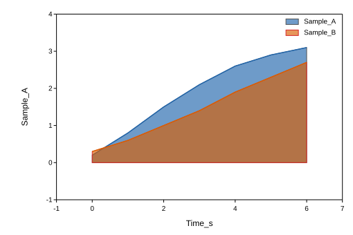

图 3.10　面积图结果示例：由当前 Plot Fig 渲染器和随附数据生成，颜色用于区分系列

#### 结果检查

两组数据分别填充到基线，两条上边界仍对应原始 Y；不是两曲线自动相加。

#### 继续调整

| 参数 / 入口 | 如何使用 |
| --- | --- |
| 填充到曲线 | 偏移与填充中选择同轴目标曲线，可显示两曲线之间的差异。 |
| 正向/负向 | 对穿越基线的数据可使用不同填充颜色。 |
| 边框 | 线宽、颜色与填充分别控制。 |

> 绘制顺序会影响遮挡。图层中后画的实心面积可能盖住前一条，用透明度或重排解决。

<a name="s57"></a>

### 3.12 直方图、箱线图与统计分布参数

入口：**图形属性 → 对应曲线 → 分箱 / 统计与分布 / 箱体与须 / 原始点与百分位**。属性窗口中的修改需应用/确定；其他入口按本行说明提交。取消属性窗口只放弃尚未应用的部分。

| 编号 / 功能 | 操作方法 | 结果检查 |
| --- | --- | --- |
| F089 自动与固定箱数 | 直方图分箱选择自动或指定箱数，后者填写整数。 | 相同数据不同箱数会改变外观，比较样本时统一规则。 |
| F090 固定箱宽 | 选择指定箱宽，填写宽度、分箱起点与终点。 | 检查范围是否覆盖全部样本。 |
| F091 自定义边界 | 指定边界输入递增列表，例如 0,5,10,20。 | 不等宽箱比较分布时宜用概率密度。 |
| F092 分箱尺度 | 选择 Linear、Log10、Log2、Ln。 | 对数分箱的数据和边界必须处于有效定义域。 |
| F093 边界包含 | 选左闭右开或左开右闭，最外端按界面规则包含。 | 恰好落在边界的样本只计一次。 |
| F094 归一化 | 统计页选频数、概率、概率密度。 | 频数合计为样本数，概率合计为 1，密度以面积解释。 |
| F095 统计标注与柱间距 | 显示统计标注；外观页调柱间距比例。 | 统计文字不遮挡直方图。 |
| F096 四分位算法 | 箱线图选择 Type 7 线性、Type 1 离散、Type 2 中点。 | 与报告中声明的计算方法一致。 |
| F097 箱体范围 | 选择 Q1–Q3、最小–最大、自定义百分位、均值±SD 或均值±SE。 | 改为非四分位箱体后须在图注明确含义。 |
| F098 须范围 | 选择 IQR 内实际样本、最小–最大、百分位、SD 或 SE，设置倍数。 | IQR 须端落在规则以内的实际样本，并非直接画到理论界限。 |
| F099 自定义百分位 | 填百分位下限、上限及额外百分位列表。 | 下限小于上限，百分位不等于原始数据单位。 |
| F100 均值、中位数与缺口 | 分别勾显示均值、显示中位数、显示缺口。 | 均值符号、中位线与箱体分开辨认。 |
| F101 置信区间 | 启用，选择均值/中位数与缺口/正态近似；适用时填置信水平。 | 例如 0.95 表示 95%；这是所选近似方法的结果。 |
| F102 原始点与离群点 | 原始点选隐藏、确定性抖动、均匀散开；独立开启离群点和极端值。 | 抖动只为显示，离群不等于数据错误。 |
| F103 连接统计量 | 勾连接均值、中位数或百分位。 | 组的先后顺序有意义时使用。 |
| F104 部件独立配色 | 外观页设置须线、中位线、均值、离群点、极端值颜色。 | 图注说明各符号含义。 |
| F105 叠加分布 | 分布选正态、对数正态、Weibull、指数、Gamma、Laplace、Lorentz、KDE、Poisson 或二项分布。 | 离散与连续分布按数据类型选择。 |
| F106 分布参数与采样 | 填写界面所列参数、采样点数、延伸比例和归一化选项。 | 显式参数是用户输入，不代表程序自动拟合成功。 |
| F107 核密度与箱图分布 | KDE 选择带宽方法或自定义带宽；箱线图分布按可用布局设对称等外观。 | 带宽会改变平滑程度；小样本不能仅凭轮廓推断总体。 |

<a name="chapter-4"></a>

CHAPTER 04 · 9 个小节

## 第 4 章　热图、矩阵与等值线

先辨认宽表矩阵、规则 XYZ 与不规则 XYZ 三种数据组织方式，再选择对应入口。颜色范围与色标设置集中在本章末尾。

学习目标：完成后，核对坐标方向、网格或采样点数量、Z 范围，以及色标是否准确表达颜色含义。

**本章小节目录**

- [4.1 热图入口与数据组织概览](#s13)
- [4.2 宽表矩阵热图](#s37)
- [4.3 XYZ 热力图](#s36)
- [4.4 线条等值线图](#s38)
- [4.5 填色等值线图](#s39)
- [4.6 不规则 XYZ 三角网热图](#s44)
- [4.7 不规则 XYZ 线条等值线](#s45)
- [4.8 不规则 XYZ 填色等值线](#s46)
- [4.9 热图、等值线与色标完整设置](#s58)

<a name="s13"></a>

### 4.1 热图入口与数据组织概览

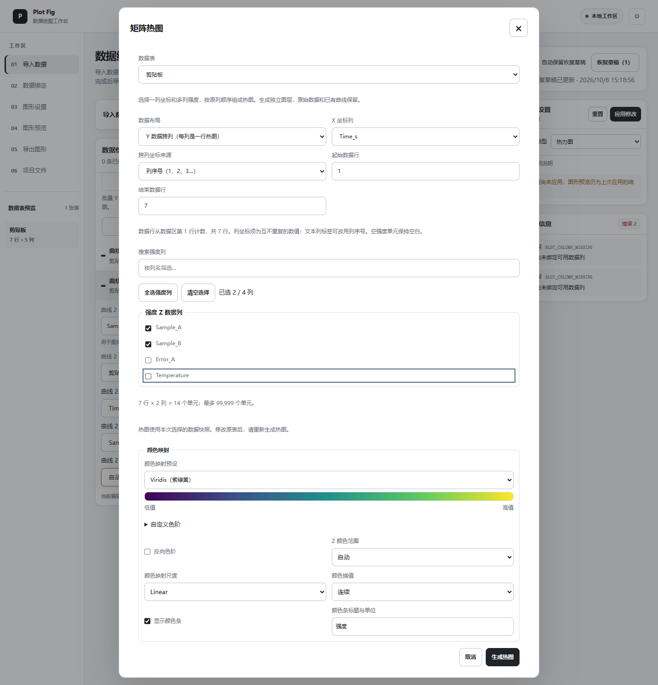

图 4.1　矩阵热图窗口；实际使用时只勾选强度列，排除误差和其他元数据列

#### 宽表矩阵热图

1. 导入 [04-matrix.csv](examples/04-matrix.csv)，将图表类型设为“热力图”，数据绑定中出现“矩阵热图”。
2. 选择 Angle 为坐标列，强度列选 500、550、1000。“Y 数据跨列”使每个强度列成为一行热图；“X 数据跨列”交换布局。
3. 跨列坐标来源选“数值列名”，得到 500、550、1000；也可选列序号、数值单位行、指定工作表行或自定义数值。坐标必须有限且不能重复。
4. 设置起止数据行、色阶、自动/固定 Z 范围、线性/Log10、连续/分块、颜色条标题，点击“生成热图”。
5. 生成独立图层后检查坐标和颜色条。热图使用生成时快照，修改原表后需重新生成。

| 设置 | 说明 |
| --- | --- |
| 预设色阶 | Viridis、Plasma、Inferno、Magma、Coolwarm、Blues、YlGnBu、Spectral、Grayscale；可反向或逐项自定义颜色。 |
| 固定范围 | 最小值必须小于最大值；多图比较时用相同范围。 |
| Log10 | 只适用于正 Z；不宜把零/负值强行当正值显示。 |
| 缺失与间距 | 缺失强度空白；热图支持非等距中心坐标，中点划分单元，也支持单行/单列。 |
| 后续修改 | 图形属性 → 热图曲线 → 颜色映射；调整配色后应用并保存。 |

#### XYZ 与等值线

导入 [05-grid.csv](examples/05-grid.csv)，分别绑定 X、Y、Z，可试热图或等值线。等值线的规则矩阵模式要求完整且等间距的二维网格；散乱点可在数据区域中选择“不规则 XYZ 三角网”，再设置级别、颜色、填充与标签，详见独立教程。

> 矩阵入口最多 99,999 单元；XYZ 热图的 X 唯一值数 × Y 唯一值数最多 100,000，等值线最多 40,000。不能把两列独立光谱强度分别当 Y 坐标与 Z，否则可能产生巨大的稀疏组合网格。

<a name="s37"></a>

### 4.2 宽表矩阵热图

本节从原始 CSV 开始完成绘图。练习时先保存当前工作，建议在新标签页从空白工作区开始，避免已有曲线和图层影响结果。

原始数据：[04-matrix.csv](examples/04-matrix.csv)。如需对照结果，可通过“打开项目”读取 [宽表矩阵热图示例项目](examples/projects/matrix.plotfig.json)。

| 角色 | 数据列 / 设置 |
| --- | --- |
| 坐标列 | Angle |
| 强度列 | 500、550、1000 |
| 布局 / 跨列坐标 | Y 数据跨列 / 数值列名 |

1. 选择文件 04-matrix.csv，表头行 1、单位行 0、数据起始行 2；确认导入后，核对数据列。
2. 当前类型选择热力图，点击数据绑定中的矩阵热图。
3. 坐标列选 Angle，勾选三个强度列，跨列坐标来源选数值列名。
4. 起始行 1、结束行 7，配色与颜色条按需要设置，点击生成热图。
5. 点击“生成图形”或“应用修改”；打开图形属性完成细节调整，确定后保存项目，再导出图片。

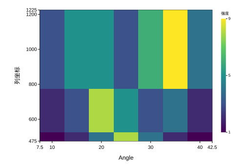

图 4.2　宽表矩阵热图结果示例：由当前 Plot Fig 渲染器和随附数据生成，颜色用于区分系列

#### 结果检查

7 个 Angle 位置 × 3 个温度位置，共 21 个单元；Y 为 500、550、1000，非等距坐标对应单元宽度不完全相等。

#### 继续调整

| 参数 / 入口 | 如何使用 |
| --- | --- |
| 交换布局 | X 数据跨列可将温度方向与 Angle 方向交换。 |
| 坐标来源 | 列序号适合非数值名字；也能从单位、指定工作表行或自定义数值读取。 |
| 更新数据 | 原表变更后重新生成矩阵热图，旧图使用创建时快照。 |

> 入口创建新的独立图层，原表与已有图层保留。本例提供的可重开项目只保留最终热图层以便阅读。

<a name="s36"></a>

### 4.3 XYZ 热力图

本节从原始 CSV 开始完成绘图。练习时先保存当前工作，建议在新标签页从空白工作区开始，避免已有曲线和图层影响结果。

原始数据：[05-grid.csv](examples/05-grid.csv)。如需对照结果，可通过“打开项目”读取 [XYZ 热力图示例项目](examples/projects/heatmap.plotfig.json)。

| 角色 | 数据列 / 设置 |
| --- | --- |
| X | X |
| Y | Y |
| Z | Z |

1. 选择文件 05-grid.csv，表头行 1、单位行 0、数据起始行 2；确认导入后，核对数据列。
2. 选择热力图，将三个角色分别绑定 X/Y/Z。
3. 颜色映射选择 Viridis，Z 范围先自动，插值选连续。
4. 色标页开启颜色条并命名为强度；检查坐标单元数量。
5. 点击“生成图形”或“应用修改”；打开图形属性完成细节调整，确定后保存项目，再导出图片。

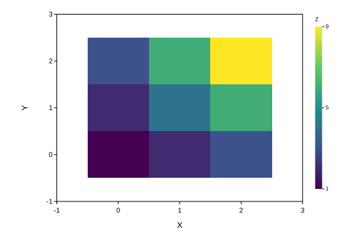

图 4.3　XYZ 热力图结果示例：由当前 Plot Fig 渲染器和随附数据生成，颜色用于区分系列

#### 结果检查

3×3 网格共 9 个位置；Z 从 1 到 9。颜色随 Z 增大变化，右侧色条对应相同范围。

#### 继续调整

| 参数 / 入口 | 如何使用 |
| --- | --- |
| 热图单元 | 按可用字段设边界、缺失格与外观。 |
| 固定 Z 范围 | 对多张图比较时统一，例如 1–9。 |
| 色标布局 | 关联范围、方向、停靠位置、长度、宽度及刻度。 |

> XYZ 是长表格式。坐标唯一值的笛卡尔组合决定网格大小，不能仅以原始行数判断内存需求。

<a name="s38"></a>

### 4.4 线条等值线图

本节从原始 CSV 开始完成绘图。练习时先保存当前工作，建议在新标签页从空白工作区开始，避免已有曲线和图层影响结果。

原始数据：[05-grid.csv](examples/05-grid.csv)。如需对照结果，可通过“打开项目”读取 [线条等值线图示例项目](examples/projects/contour.plotfig.json)。

| 角色 | 数据列 / 设置 |
| --- | --- |
| X / Y / Z | X / Y / Z |
| 显示 | 线条 |

1. 选择文件 05-grid.csv，表头行 1、单位行 0、数据起始行 2；确认导入后，核对数据列。
2. 选择等值线图，绑定 X、Y、Z。
3. 图形属性 → 等高线，等值线显示选线条，等值层方式选自动层数。
4. 要突出指定阈值，改为指定层值，例如 2,4,6,8；或添加逐级样式。
5. 点击“生成图形”或“应用修改”；打开图形属性完成细节调整，确定后保存项目，再导出图片。

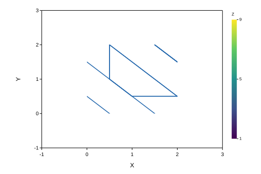

图 4.4　线条等值线图结果示例：由当前 Plot Fig 渲染器和随附数据生成，颜色用于区分系列

#### 结果检查

由同一 3×3 网格生成若干等 Z 线；不是把原始行顺次连接。

#### 继续调整

| 参数 / 入口 | 如何使用 |
| --- | --- |
| 层级方式 | 自动层数、指定层值、起止与步长。 |
| 逐级样式 | 指定层值、该层线色与线宽，可删除多余覆盖。 |
| 统一样式 | 线条页控制整体线色和宽度，颜色映射控制色阶。 |

> 本节选择规则矩阵，要求完整等距网格。散乱点应改选不规则 XYZ 三角网，参见后续专门教程；3×3 教学网格只用于理解操作。

<a name="s39"></a>

### 4.5 填色等值线图

本节从原始 CSV 开始完成绘图。练习时先保存当前工作，建议在新标签页从空白工作区开始，避免已有曲线和图层影响结果。

原始数据：[05-grid.csv](examples/05-grid.csv)。如需对照结果，可通过“打开项目”读取 [填色等值线图示例项目](examples/projects/contour-filled.plotfig.json)。

| 角色 | 数据列 / 设置 |
| --- | --- |
| X / Y / Z | X / Y / Z |
| 显示 | 填色 |

1. 选择文件 05-grid.csv，表头行 1、单位行 0、数据起始行 2；确认导入后，核对数据列。
2. 先建立上一节等值线图。
3. 等高线页将显示从线条改为填色，设置层值或等值层数。
4. 统一颜色映射范围并打开色标，调整需要强调的层线样式。
5. 点击“生成图形”或“应用修改”；打开图形属性完成细节调整，确定后保存项目，再导出图片。

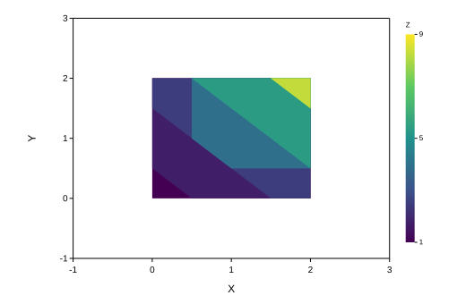

图 4.5　填色等值线图结果示例：由当前 Plot Fig 渲染器和随附数据生成，颜色用于区分系列

#### 结果检查

相邻等值层之间呈现色带，颜色条用于解释 Z；改变层数会改变色带数量。

#### 继续调整

| 参数 / 入口 | 如何使用 |
| --- | --- |
| 分层与连续 | 等值层决定几何分区，色阶插值决定颜色取值，两者分别检查。 |
| 多图比较 | 所有图使用相同层值列表和 Z 范围。 |

> 填色等值线是等值线图的显示模式，不是热力图；前者描述等值分区，后者直接显示网格单元。

<a name="s44"></a>

### 4.6 不规则 XYZ 三角网热图

本节从原始 CSV 开始完成绘图。练习时先保存当前工作，建议在新标签页从空白工作区开始，避免已有曲线和图层影响结果。

原始数据：[08-irregular.csv](examples/08-irregular.csv)。如需对照结果，可通过“打开项目”读取 [不规则 XYZ 三角网热图示例项目](examples/projects/irregular-heatmap.plotfig.json)。

| 角色 | 数据列 / 设置 |
| --- | --- |
| X / Y / Z | X / Y / Z |
| 数据区域 | 不规则 XYZ 三角网 |

1. 选择文件 08-irregular.csv，表头行 1、单位行 0、数据起始行 2；确认导入后，核对数据列。
2. 选择热力图或等值线图，分别绑定 X、Y、Z，进入图形属性。
3. 在热图单元页将数据区域改为“不规则 XYZ 三角网”。
4. 热图可显示单元标签；等值线按教程标题选择线条或填色，设置等值级别，再调整色标。
5. 点击“生成图形”或“应用修改”；打开图形属性完成细节调整，确定后保存项目，再导出图片。

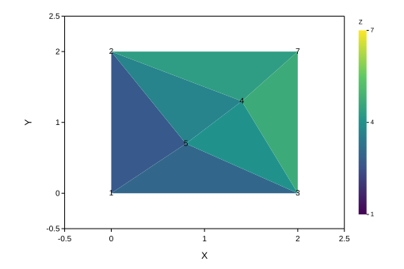

图 4.6　不规则 XYZ 三角网热图结果示例：由当前 Plot Fig 渲染器和随附数据生成，颜色用于区分系列

#### 结果检查

6 个非规则采样点构成三角网。热图按三角单元着色，等值线在三角网内生成；结果不应被误读为原始矩阵单元。

#### 继续调整

| 参数 / 入口 | 如何使用 |
| --- | --- |
| 颜色范围 | 多图比较保持相同 Z 范围。 |
| 原始点 | 检查没有重复坐标且不共线。 |
| 模式区别 | 规则矩阵与不规则 XYZ 采用不同几何处理，不要混用默认设置。 |

> 不规则 XYZ 至少 3 个有限且不共线的点，最多 10,000 点，不允许重复坐标。三角网内的显示是插值/单元表示，不是额外实测数据；不保证域外外推。

<a name="s45"></a>

### 4.7 不规则 XYZ 线条等值线

本节从原始 CSV 开始完成绘图。练习时先保存当前工作，建议在新标签页从空白工作区开始，避免已有曲线和图层影响结果。

原始数据：[08-irregular.csv](examples/08-irregular.csv)。如需对照结果，可通过“打开项目”读取 [不规则 XYZ 线条等值线示例项目](examples/projects/irregular-contour.plotfig.json)。

| 角色 | 数据列 / 设置 |
| --- | --- |
| X / Y / Z | X / Y / Z |
| 数据区域 | 不规则 XYZ 三角网 |

1. 选择文件 08-irregular.csv，表头行 1、单位行 0、数据起始行 2；确认导入后，核对数据列。
2. 选择热力图或等值线图，分别绑定 X、Y、Z，进入图形属性。
3. 在等高线页将数据区域改为“不规则 XYZ 三角网”。
4. 热图可显示单元标签；等值线按教程标题选择线条或填色，设置等值级别，再调整色标。
5. 点击“生成图形”或“应用修改”；打开图形属性完成细节调整，确定后保存项目，再导出图片。

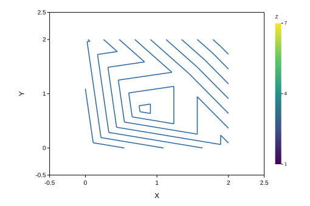

图 4.7　不规则 XYZ 线条等值线结果示例：由当前 Plot Fig 渲染器和随附数据生成，颜色用于区分系列

#### 结果检查

6 个非规则采样点构成三角网。热图按三角单元着色，等值线在三角网内生成；结果不应被误读为原始矩阵单元。

#### 继续调整

| 参数 / 入口 | 如何使用 |
| --- | --- |
| 颜色范围 | 多图比较保持相同 Z 范围。 |
| 原始点 | 检查没有重复坐标且不共线。 |
| 模式区别 | 规则矩阵与不规则 XYZ 采用不同几何处理，不要混用默认设置。 |

> 不规则 XYZ 至少 3 个有限且不共线的点，最多 10,000 点，不允许重复坐标。三角网内的显示是插值/单元表示，不是额外实测数据；不保证域外外推。

<a name="s46"></a>

### 4.8 不规则 XYZ 填色等值线

本节从原始 CSV 开始完成绘图。练习时先保存当前工作，建议在新标签页从空白工作区开始，避免已有曲线和图层影响结果。

原始数据：[08-irregular.csv](examples/08-irregular.csv)。如需对照结果，可通过“打开项目”读取 [不规则 XYZ 填色等值线示例项目](examples/projects/irregular-filled.plotfig.json)。

| 角色 | 数据列 / 设置 |
| --- | --- |
| X / Y / Z | X / Y / Z |
| 数据区域 | 不规则 XYZ 三角网 |

1. 选择文件 08-irregular.csv，表头行 1、单位行 0、数据起始行 2；确认导入后，核对数据列。
2. 选择热力图或等值线图，分别绑定 X、Y、Z，进入图形属性。
3. 在等高线页将数据区域改为“不规则 XYZ 三角网”。
4. 热图可显示单元标签；等值线按教程标题选择线条或填色，设置等值级别，再调整色标。
5. 点击“生成图形”或“应用修改”；打开图形属性完成细节调整，确定后保存项目，再导出图片。

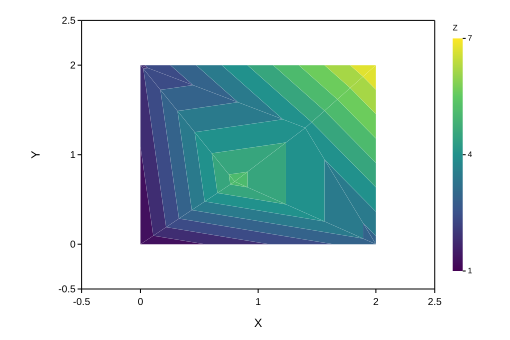

图 4.8　不规则 XYZ 填色等值线结果示例：由当前 Plot Fig 渲染器和随附数据生成，颜色用于区分系列

#### 结果检查

6 个非规则采样点构成三角网。热图按三角单元着色，等值线在三角网内生成；结果不应被误读为原始矩阵单元。

#### 继续调整

| 参数 / 入口 | 如何使用 |
| --- | --- |
| 颜色范围 | 多图比较保持相同 Z 范围。 |
| 原始点 | 检查没有重复坐标且不共线。 |
| 模式区别 | 规则矩阵与不规则 XYZ 采用不同几何处理，不要混用默认设置。 |

> 不规则 XYZ 至少 3 个有限且不共线的点，最多 10,000 点，不允许重复坐标。三角网内的显示是插值/单元表示，不是额外实测数据；不保证域外外推。

<a name="s58"></a>

### 4.9 热图、等值线与色标完整设置

入口：**图形属性 → 热力图 / 等值线 → 热图单元 / 等高线 / 颜色映射 / 色标**。属性窗口中的修改需应用/确定；其他入口按本行说明提交。取消属性窗口只放弃尚未应用的部分。

| 编号 / 功能 | 操作方法 | 结果检查 |
| --- | --- | --- |
| F108 热图数据区域 | 选矩形网格或不规则 XYZ 三角网。 | 规则格点与散乱点使用对应区域模式。 |
| F109 单元插值 | 最近单元保留分块，双线性产生连续过渡。 | 插值后的颜色不是新增测量值。 |
| F110 缺失单元 | 设置缺失值颜色。 | 空白单元与数值为零的单元应可区分。 |
| F111 单元标签与边界 | 勾单元标签、单元边界，设置边界颜色和宽度。 | 密集矩阵减少标签以保持可读。 |
| F112 等值线线条/填色 | 等高线页选择线条或填色模式。 | 填色区间和色标方向一致。 |
| F113 等值级别 | 用自动数量、显式数值列表或起点/终点/步长定义。 | 科学比较使用共同级别。 |
| F114 逐级线型覆盖 | 添加级别覆盖，输入 level 及颜色/线宽；不需要时删除。 | 仅影响对应级别，最多 50 项。 |
| F115 等值线平滑与标签 | 选择规则矩阵/不规则 XYZ；开启平滑或数值标签。 | 平滑改变显示路径，不能替代更密采样。 |
| F116 范围外颜色 | 钳制到端点或透明。 | 透明模式下范围外区域消失是预期效果。 |
| F117 Z 色域 | 自动范围或输入固定最小最大值；按需反转。 | 多个热图使用同一 Z 范围才能直接比较。 |
| F118 颜色尺度 | 选线性或 Log10；选连续渐变或离散颜色。 | Log10 不适合非正 Z。 |
| F119 色谱预设和节点 | 选择色谱，编辑颜色节点、位置，添加/删除节点。 | 最多 32 节点，顺序和范围符合预览。 |
| F120 色标显示和标题 | 勾显示色标，填物理量及单位。 | 仅关闭图例不会必然关闭色标。 |
| F121 色标联动/独立 | 联动跟随 Z 色域；独立模式输入自己的显示范围。 | 独立色标须核对是否仍准确表达实际颜色。 |
| F122 色标方向与位置 | 垂直选左/右，水平选上/下；调长度比例和宽度 pt。 | 为色标留出页边空间。 |
| F123 色标刻度与端点 | 设置主次刻度数量、记数法、精度和两端三角形。 | 三角端点配合图注解释超范围值。 |

<a name="chapter-5"></a>

CHAPTER 05 · 7 个小节

## 第 5 章　多轴图、图层与页面布局

先理解图页、图层和坐标轴的关系，再跟做双纵轴、三纵轴、四纵轴和共享横轴教程。随后调整页面尺寸、图层排列与联动。

学习目标：完成后，每条曲线应对应正确的轴，外侧标题和图例应完整位于图页内。

**本章小节目录**

- [5.1 图层、页面尺寸、多纵轴与共享 X 布局](#s16)
- [5.2 双纵轴图](#s40)
- [5.3 三纵轴图](#s41)
- [5.4 四纵轴图](#s42)
- [5.5 上下共享横轴图](#s43)
- [5.6 图页与图层参数详解](#s53)
- [5.7 图层管理、轴关系与格式复用](#s62)

<a name="s16"></a>

### 5.1 图层、页面尺寸、多纵轴与共享 X 布局

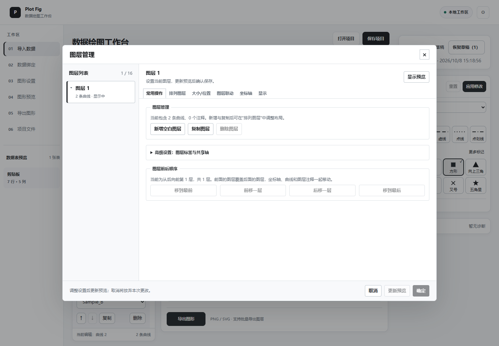

图 5.1　图层管理：常用操作、排列、大小/位置、联动、坐标轴与显示

| 入口 | 操作 |
| --- | --- |
| 新建图层 / 删除当前图层 | 预览工具栏直接操作；至少保留一层，最多 16 层。 |
| 图层管理 → 图层内容 | 检查当前层曲线内容、调整成员与顺序。 |
| 图层管理 → 图表绘制 | 检查绘图设置和数据分配，确认后更新结果。 |
| 图层管理 → 图层管理 | 新增空白层、复制、删除，调整前后层次。 |
| 排列图层 | 根据布局控件设置行列、间隔与排列，更新预览后确定。 |
| 大小/位置 | 指定左侧、顶部、宽高；参考整个图页或边距内区域，单位可用 %、mm、cm、in、px。 |
| 图层联动 | 指定父图层、位置偏移与尺寸比例；明确哪些轴或尺寸需要联动。 |
| 显示 | 管理可见性、背景、裁剪等；隐藏不等于删除数据。 |

#### 页面与绘图区

图形属性 → 图页 → 打印/尺寸设置页面物理大小；图层 → 大小设置绘图区位置和尺寸。锁定图层宽高比保持形状；“关联轴长与数据比例”约束 X:Y 的数据单位比例，含义与外框长宽比不同。内容适配可辅助整理留白，提交前检查标题与色标。

#### 多纵轴与上下共享 X

1. 先导入所需曲线，图形设置选双、三、四纵轴或上下共享横轴。
2. 为新增曲线分配数据列与相应轴；同一量纲优先共轴，不同量级可分轴。
3. 应用预设后检查页面。三/四纵轴外侧轴默认偏移 60 pt；绘图区不足 60 pt 会提示增大页面。
4. 旧项目直接打开保留旧布局；若外侧轴裁切，可重新应用预设，再手动调整长标题、字号和留白。

> 复制图层会复制配置，仍需检查引用的数据和轴。图层前后顺序影响遮挡；裁剪到图层边框可能截掉超出范围的对象。完整模板可能替换布局，应用前先预览。

<a name="s40"></a>

### 5.2 双纵轴图

本节从原始 CSV 开始完成绘图。练习时先保存当前工作，建议在新标签页从空白工作区开始，避免已有曲线和图层影响结果。

原始数据：[07-multi-axis.csv](examples/07-multi-axis.csv)。如需对照结果，可通过“打开项目”读取 [双纵轴图示例项目](examples/projects/double-y.plotfig.json)。

| 角色 | 数据列 / 设置 |
| --- | --- |
| X | X |
| Y | A、B |
| 分配目标 | A→左 Y，B→右 Y |

1. 选择文件 07-multi-axis.csv，表头行 1、单位行 0、数据起始行 2；确认导入后，核对数据列。
2. 先以折线图批量选择 Y 列：A、B，共用 X 列为 X，应用一次确认各曲线有数据。
3. 图表类型改为双纵轴图，检查预设创建的曲线、图层与纵轴分配，应用修改。
4. 依次选择各曲线核对对应 Y；在坐标轴属性中为每一轴填写含单位的手动标题，必要时使用与曲线一致的颜色。
5. 双/三/四纵轴示例将 A/B/C/D 的 Y 范围分别固定为 0–4、0–80、0–1000、0–9000，避免线性教学数据在各自自动范围下完全重合。删除重复图例，新增图页坐标的跨层图例，位置 X=0.45、Y=0.92；上下共享 X 示例保持自动范围。
6. 点击“生成图形”或“应用修改”；打开图形属性完成细节调整，确定后保存项目，再导出图片。

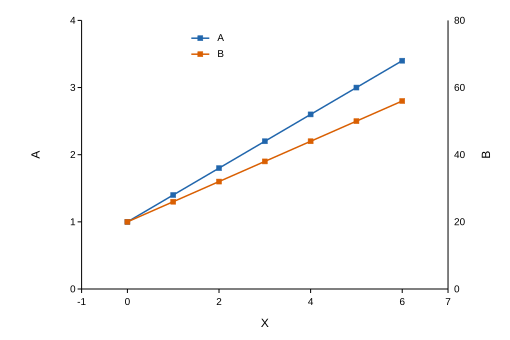

图 5.2　双纵轴图结果示例：由当前 Plot Fig 渲染器和随附数据生成，颜色用于区分系列

#### 结果检查

应有 2 条曲线；A→左 Y，B→右 Y。A、B、C、D 分别约为个位、十位、百位和千位量级，不能共用一个数值轴后仍期待全部清晰。

#### 继续调整

| 参数 / 入口 | 如何使用 |
| --- | --- |
| 预设结构 | 双轴在单层配置左右轴；三/四轴用重叠联动图层；共享 X 用上下分层。 |
| 范围 | 每个 Y 可独立设范围，X 保持需要的联动。 |
| 页面空间 | 三/四轴外侧留白不足时先增大图页，再检查轴标题与色标。 |

> 下拉预设会改变图层和轴结构，应用前保存项目。重新打开旧项目保留旧布局；当前轴范围也会进入导出。

<a name="s41"></a>

### 5.3 三纵轴图

本节从原始 CSV 开始完成绘图。练习时先保存当前工作，建议在新标签页从空白工作区开始，避免已有曲线和图层影响结果。

原始数据：[07-multi-axis.csv](examples/07-multi-axis.csv)。如需对照结果，可通过“打开项目”读取 [三纵轴图示例项目](examples/projects/triple-y.plotfig.json)。

| 角色 | 数据列 / 设置 |
| --- | --- |
| X | X |
| Y | A、B、C |
| 分配目标 | A→左 Y，B→右 Y，C→外右 Y |

1. 选择文件 07-multi-axis.csv，表头行 1、单位行 0、数据起始行 2；确认导入后，核对数据列。
2. 先以折线图批量选择 Y 列：A、B、C，共用 X 列为 X，应用一次确认各曲线有数据。
3. 图表类型改为三纵轴图，检查预设创建的曲线、图层与纵轴分配，应用修改。
4. 依次选择各曲线核对对应 Y；在坐标轴属性中为每一轴填写含单位的手动标题，必要时使用与曲线一致的颜色。
5. 双/三/四纵轴示例将 A/B/C/D 的 Y 范围分别固定为 0–4、0–80、0–1000、0–9000，避免线性教学数据在各自自动范围下完全重合。删除重复图例，新增图页坐标的跨层图例，位置 X=0.45、Y=0.92；上下共享 X 示例保持自动范围。
6. 点击“生成图形”或“应用修改”；打开图形属性完成细节调整，确定后保存项目，再导出图片。

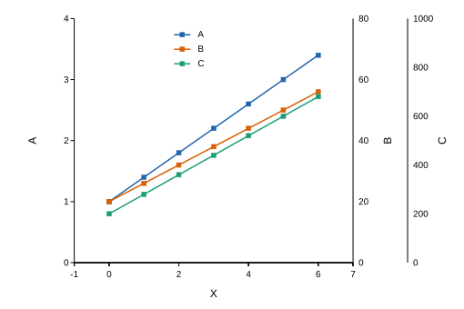

图 5.3　三纵轴图结果示例：由当前 Plot Fig 渲染器和随附数据生成，颜色用于区分系列

#### 结果检查

应有 3 条曲线；A→左 Y，B→右 Y，C→外右 Y。A、B、C、D 分别约为个位、十位、百位和千位量级，不能共用一个数值轴后仍期待全部清晰。

#### 继续调整

| 参数 / 入口 | 如何使用 |
| --- | --- |
| 预设结构 | 双轴在单层配置左右轴；三/四轴用重叠联动图层；共享 X 用上下分层。 |
| 范围 | 每个 Y 可独立设范围，X 保持需要的联动。 |
| 页面空间 | 三/四轴外侧留白不足时先增大图页，再检查轴标题与色标。 |

> 下拉预设会改变图层和轴结构，应用前保存项目。重新打开旧项目保留旧布局；当前轴范围也会进入导出。

<a name="s42"></a>

### 5.4 四纵轴图

本节从原始 CSV 开始完成绘图。练习时先保存当前工作，建议在新标签页从空白工作区开始，避免已有曲线和图层影响结果。

原始数据：[07-multi-axis.csv](examples/07-multi-axis.csv)。如需对照结果，可通过“打开项目”读取 [四纵轴图示例项目](examples/projects/quad-y.plotfig.json)。

| 角色 | 数据列 / 设置 |
| --- | --- |
| X | X |
| Y | A、B、C、D |
| 分配目标 | A→左 Y，B→右 Y，C→外左 Y，D→外右 Y |

1. 选择文件 07-multi-axis.csv，表头行 1、单位行 0、数据起始行 2；确认导入后，核对数据列。
2. 先以折线图批量选择 Y 列：A、B、C、D，共用 X 列为 X，应用一次确认各曲线有数据。
3. 图表类型改为四纵轴图，检查预设创建的曲线、图层与纵轴分配，应用修改。
4. 依次选择各曲线核对对应 Y；在坐标轴属性中为每一轴填写含单位的手动标题，必要时使用与曲线一致的颜色。
5. 双/三/四纵轴示例将 A/B/C/D 的 Y 范围分别固定为 0–4、0–80、0–1000、0–9000，避免线性教学数据在各自自动范围下完全重合。删除重复图例，新增图页坐标的跨层图例，位置 X=0.45、Y=0.92；上下共享 X 示例保持自动范围。
6. 点击“生成图形”或“应用修改”；打开图形属性完成细节调整，确定后保存项目，再导出图片。

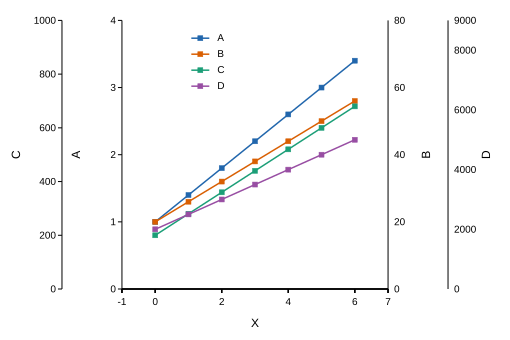

图 5.4　四纵轴图结果示例：由当前 Plot Fig 渲染器和随附数据生成，颜色用于区分系列

#### 结果检查

应有 4 条曲线；A→左 Y，B→右 Y，C→外左 Y，D→外右 Y。A、B、C、D 分别约为个位、十位、百位和千位量级，不能共用一个数值轴后仍期待全部清晰。

#### 继续调整

| 参数 / 入口 | 如何使用 |
| --- | --- |
| 预设结构 | 双轴在单层配置左右轴；三/四轴用重叠联动图层；共享 X 用上下分层。 |
| 范围 | 每个 Y 可独立设范围，X 保持需要的联动。 |
| 页面空间 | 三/四轴外侧留白不足时先增大图页，再检查轴标题与色标。 |

> 下拉预设会改变图层和轴结构，应用前保存项目。重新打开旧项目保留旧布局；当前轴范围也会进入导出。

<a name="s43"></a>

### 5.5 上下共享横轴图

本节从原始 CSV 开始完成绘图。练习时先保存当前工作，建议在新标签页从空白工作区开始，避免已有曲线和图层影响结果。

原始数据：[07-multi-axis.csv](examples/07-multi-axis.csv)。如需对照结果，可通过“打开项目”读取 [上下共享横轴图示例项目](examples/projects/stacked-shared-x.plotfig.json)。

| 角色 | 数据列 / 设置 |
| --- | --- |
| X | X |
| Y | A、B |
| 分配目标 | A 与 B 分别放入上下图层，X 联动 |

1. 选择文件 07-multi-axis.csv，表头行 1、单位行 0、数据起始行 2；确认导入后，核对数据列。
2. 先以折线图批量选择 Y 列：A、B，共用 X 列为 X，应用一次确认各曲线有数据。
3. 图表类型改为上下共享横轴图，检查预设创建的曲线、图层与纵轴分配，应用修改。
4. 依次选择各曲线核对对应 Y；在坐标轴属性中为每一轴填写含单位的手动标题，必要时使用与曲线一致的颜色。
5. 双/三/四纵轴示例将 A/B/C/D 的 Y 范围分别固定为 0–4、0–80、0–1000、0–9000，避免线性教学数据在各自自动范围下完全重合。删除重复图例，新增图页坐标的跨层图例，位置 X=0.45、Y=0.92；上下共享 X 示例保持自动范围。
6. 点击“生成图形”或“应用修改”；打开图形属性完成细节调整，确定后保存项目，再导出图片。

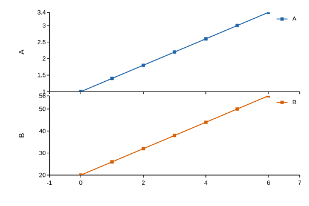

图 5.5　上下共享横轴图结果示例：由当前 Plot Fig 渲染器和随附数据生成，颜色用于区分系列

#### 结果检查

应有 2 条曲线；A 与 B 分别放入上下图层，X 联动。A、B、C、D 分别约为个位、十位、百位和千位量级，不能共用一个数值轴后仍期待全部清晰。

#### 继续调整

| 参数 / 入口 | 如何使用 |
| --- | --- |
| 预设结构 | 双轴在单层配置左右轴；三/四轴用重叠联动图层；共享 X 用上下分层。 |
| 范围 | 每个 Y 可独立设范围，X 保持需要的联动。 |
| 页面空间 | 三/四轴外侧留白不足时先增大图页，再检查轴标题与色标。 |

> 下拉预设会改变图层和轴结构，应用前保存项目。重新打开旧项目保留旧布局；当前轴范围也会进入导出。

<a name="s53"></a>

### 5.6 图页与图层参数详解

入口：**图形属性 → 图页 / 图层**。属性窗口中的修改需应用/确定；其他入口按本行说明提交。取消属性窗口只放弃尚未应用的部分。

| 编号 / 功能 | 操作方法 | 结果检查 |
| --- | --- | --- |
| F001 页面物理宽高 | 打印/尺寸中输入宽高及 mm/cm/in/px 单位。 | 单位切换保持实际尺寸；改变数值才改变大小。 |
| F002 页面横纵方向 | 选择横向或纵向交换页面方向。 | 检查图层与外侧轴留白。 |
| F003 页面宽高比锁定 | 锁定后修改宽或高，另一项自动换算。 | 不把锁定外框比当数据 X:Y 比。 |
| F004 页面变化时图层处理 | 选择随页面缩放或保留实际尺寸和位置，再改页面。 | 固定尺寸模式下注意图层可能超出新页面。 |
| F005 内容适配 | 使用内容适配按钮按内容整理页面/图层，必要时保持比例。 | 标题、图例、色标均处于可见区域。 |
| F006 名称与描述 | 图页 → 其他，修改名称与描述。 | 保存/导出默认名字与项目信息符合预期。 |
| F007 页面纯色/透明/图案 | 图页 → 显示，设置背景 Paint 类型、颜色和图案。 | 透明页面不自动移除图层底色。 |
| F008 页面图层列表 | 图页 → 图层中切换显示并进入该层属性。 | 隐藏层保留数据，后续范围和图例不再按可见层处理它。 |
| F009 集中图例条目 | 图页 → 图例/标题，逐曲线设置是否显示、名称。 | 图例与数据系列一致。 |
| F010 图层背景 | 图层 → 背景，选颜色与 0–1 值。 | 该背景字段 0 为透明、1 为不透明，虽然标签写“透明度”，按旁边提示理解。 |
| F011 图层边框 | 启用边框，设置颜色、线宽、线型。 | 不能与坐标轴边框混淆。 |
| F012 图层阴影 | 启用阴影并设置颜色、透明度、X/Y 偏移。 | 导出边界容纳阴影。 |
| F013 图层名称和可见性 | 显示/速度页设置名字与显示图层。 | 隐藏不是删除，重新勾选可恢复。 |
| F014 裁剪开关与余量 | 启用裁剪，设置水平/垂直余量。 | 正数向内、负数向外，范围 −100% 至小于 50%。 |
| F015 轴与数据前后顺序 | 显示/速度页选数据在轴上方或轴在数据上方。 | 粗线在交叉轴处没有意外遮挡。 |
| F016 图层位置尺寸 | 大小页选参考图页/边距内区域，填左、上、宽、高。 | % 与物理单位含义不同。 |
| F017 锁定图层宽高比 | 勾选锁定后改一边。 | 图层外框保持比例，不保证数据单位等长。 |
| F018 位置尺寸父图层 | 选父层，设置相对位置偏移和宽高比例。 | 父层改变后子层按关系移动，禁止循环关系。 |
| F019 叠放顺序 | 移到最前、前移、后移、移到最后。 | 透明层与不透明层遮挡符合预期。 |
| F020 轴长与数据比例 | 关联轴长与数据比例，选轴并设置比例。 | 实际 X/Y 轴长与范围满足约束；小尺寸/断轴等不支持组合查看提示。 |

<a name="s62"></a>

### 5.7 图层管理、轴关系与格式复用

入口：**图形菜单 / 图层管理；图形属性 → 页面/图层**。属性窗口中的修改需应用/确定；其他入口按本行说明提交。取消属性窗口只放弃尚未应用的部分。

| 编号 / 功能 | 操作方法 | 结果检查 |
| --- | --- | --- |
| F180 新增/复制图层 | 图层管理常用操作新增空层，或复制当前层。 | 检查曲线是否也复制以及当前选中层。 |
| F181 删除图层 | 选择层并检查依赖提示后删除，至少保留一层。 | 轴/框架联动和跨层对象的依赖应按提示处理。 |
| F182 图层顺序 | 用前移/后移等顺序操作调整覆盖关系。 | 重叠层中后绘制内容可能遮住前层。 |
| F183 移动曲线 | 曲线所属图层选择目标层及兼容 X/Y 轴，点击移动曲线。 | 保留数据、样式、名称，使用目标轴范围；源层仍保留。 |
| F184 图层内容与绘图设置 | 从相应管理模式检查层内曲线及其绑定，增删或调整。 | 变更数据槽后重新生成/应用。 |
| F185 网格排列 | 选择参与层、参照区域、列数和横纵间距，再执行排列。 | 间距单位可选 %、mm、cm、in、px。 |
| F186 位置与尺寸对齐 | 选择参考层/区域，再左中右、上中下或统一宽/高/尺寸。 | 联动层可能限制直接编辑。 |
| F187 共享坐标范围 | 在共享轴入口选参与层及维度。 | 同一物理量和单位才能合理共享范围。 |
| F188 轴公式联动 | 选源图层/轴，输入正逆公式与有效域。 | 例如单位换算；避免循环引用和不可逆函数。 |
| F189 图层框架联动 | 为位置/尺寸选择源层和联动方式，按需解除。 | 它控制几何布局，与坐标范围联动分别设置。 |
| F190 添加对应轴 | 使用轴创建入口增加上/右等对应轴，并设置来源与映射。 | 新增轴不自动把所有曲线移到新轴。 |
| F191 复制粘贴格式 | 选择源层复制格式，目标层选择粘贴范围再执行。 | 图例格式不覆盖名称；尺寸复用保留位置。 |
| F192 格式类别 | 可选页面背景、图例、背景、尺寸、刻度、颜色、字体、所有样式或所有格式。 | 所有样式保留尺寸/范围；所有格式可能固定目标范围。 |
| F193 页面适配内容 | 在页面/图层大小的适配入口执行并检查边距。 | 标题、轴标签、图例和色标都要在页面内。 |

<a name="chapter-6"></a>

CHAPTER 06 · 10 个小节

## 第 6 章　曲线样式、标注与分组堆叠

图形生成后，按显示目的调整线条、符号、标签、误差与注释。多曲线的统一配色和错位展示，通过曲线组与图层堆叠设置。

学习目标：完成后，检查样式映射、单点覆盖、误差含义和堆叠偏移；原始数据与视觉处理应能区分。

**本章小节目录**

- [6.1 折线、符号、映射与单点样式](#s08)
- [6.2 数据视图、子集、误差线和数据标签](#s09)
- [6.3 曲线组、调色板与连续组色标](#s10)
- [6.4 堆叠、偏移、倍率与子组](#s11)
- [6.5 文字、公式、图例与图形标注](#s17)
- [6.6 曲线显示、线条、颜色与填充](#s54)
- [6.7 符号、三类映射与单点覆盖](#s55)
- [6.8 数据视图、标签、误差与投影线](#s56)
- [6.9 曲线组、颜色递增和六种堆叠模式](#s59)
- [6.10 注释、图例与文字排版](#s63)

<a name="s08"></a>

### 6.1 折线、符号、映射与单点样式

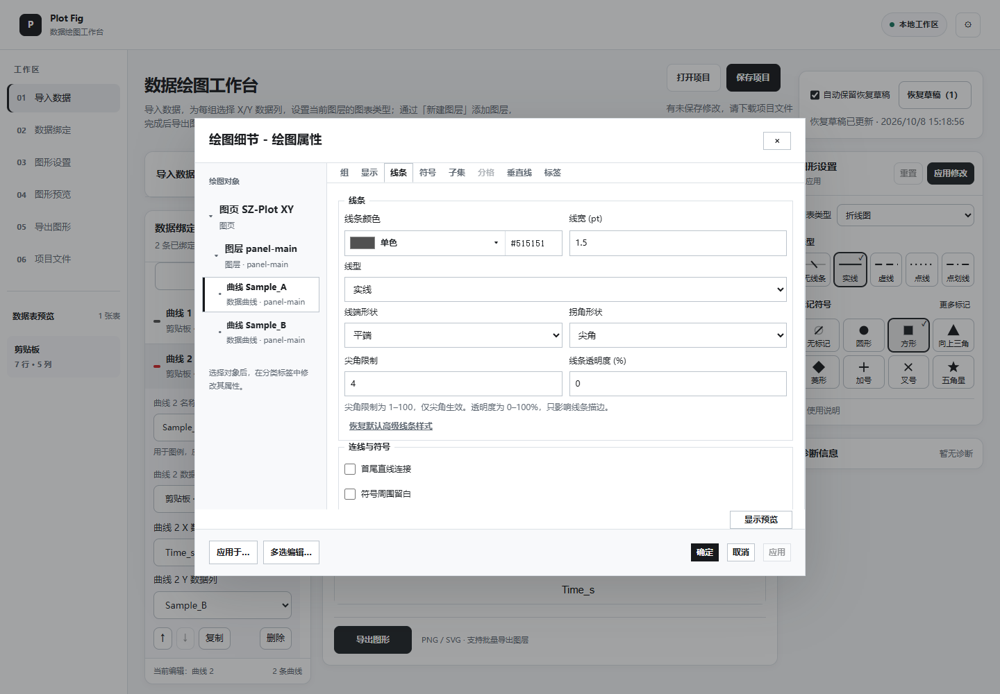

图 6.1　绘图细节：左侧选择曲线，右侧线条页调整外观

1. 在预览工具栏打开“图形属性”，左侧选择具体曲线。
2. 在线条页调整颜色、线宽、线型、透明度；在符号页调整形状、大小、边框和填充。
3. 高级字段按需要启用，展开预览检查；点击应用或确定。

| 功能 | 使用说明 |
| --- | --- |
| 线条外观 | 实线、虚线、点线、点划线及自定义虚线；设置平/圆/方线端、尖/圆/斜拐角和尖角限制。 |
| 连接与附加线 | 可用配置包括首尾连接、符号周围留白、箭头位置、线条前后顺序；先看相应控件是否对当前对象开放。 |
| 填充 | “曲线下填充区域”打开填充相关页；面积图可设置基线、颜色、透明度及可用的曲线间填充。 |
| 符号细节 | 按数据单位固定尺寸、边框按半径缩放、仅填充使用透明度、字符符号与字体。 |
| 重合点 | 展开重合数据点，设方向、间距及是否标出真实位置，避免把视觉位移当成新数据。 |
| 连续/分类映射 | 选择映射方式和数据列；颜色可按数值或类别，大小可按数值，符号可按可用映射设置。 |
| 单点设置 | 按原始数据行指定单点外观；抽样与排序后核对其原始行身份。 |
| 映射图例 | 设置图例样本原始行与符号尺寸，使图例准确表达映射。 |

#### 颜色映射的三种范围

固定颜色作用于一条曲线；曲线组颜色按成员给整条曲线着色；“线条颜色映射”按一条曲线内部的数据行着色。后者支持按原行递增、连续数值列与分类映射，优先于组颜色。

> 不透明度与透明度字段的语义不同：透明度 0% 为完全不透明。映射列须属于正确的数据表；换表、删列后重新检查绑定。

<a name="s09"></a>

### 6.2 数据视图、子集、误差线和数据标签

#### 显示数据与原始数据

在曲线属性的“显示”中设置行范围、无效点连接、X 排序与重复 X 处理。原始表保持不变；“计算与自动范围的数据来源”决定统计与范围依据原始数据还是处理后的所选数据。

| 选项 | 效果 |
| --- | --- |
| 无效点连接 | 跨过无效点连接，或在无效点处断开。 |
| X 排序 | 保留原始顺序、升序或降序；循环扫描数据通常应先保留原序。 |
| 重复 X | 保留全部，或保留原始第一行/最后一行。 |
| 显示抽样 | 不抽样、每隔若干点、按总点数；可保留每段首尾。 |
| 导出也使用抽样数据 | 仅在明确需要时开启；默认导出不因预览抽样而丢弃完整数据，仍保留数据视图和子集限制。 |
| 子集 | 按固定行数或分组列划分曲线内部子集，可断开子集间连线。 |

#### 误差与标签

入口：图形属性 → 选择曲线。XY 曲线的误差字段位于“标签”页下方；柱图使用独立“误差”页。选择 X/Y 或值方向，对称 ± 绑定一列，非对称 −/+ 分别绑定两列；关闭则不绘制该方向。

1. 选择 Sample_A → 标签，向下滚动到误差设置，Y 误差模式选“对称 ±”，误差列选 01-xy.csv 的 Error_A，检查预览是否为各点上下延伸。
2. 高级误差中区分“误差幅值”与“绝对端点”，再选方向、基线、棒或带、连接方式、线色、透明度、抽样与符号避让。
3. 在“标签/数据标签”启用标签，选择来源和格式，调整位置、偏移、字体；密集图先抽样显示标签，避免全部重叠。
4. “垂直线”可将点投影到基线；高级目标可选同轴曲线及插值位置，目标曲线变化后重新检查。

> 误差幅值与绝对端点不可混用。单纯把 Error_A 加为普通 Y 曲线，不会自动得到误差棒。XY 的“标签”页同时容纳标签和误差，窗口较小时需要向下滚动。

<a name="s10"></a>

### 6.3 曲线组、调色板与连续组色标

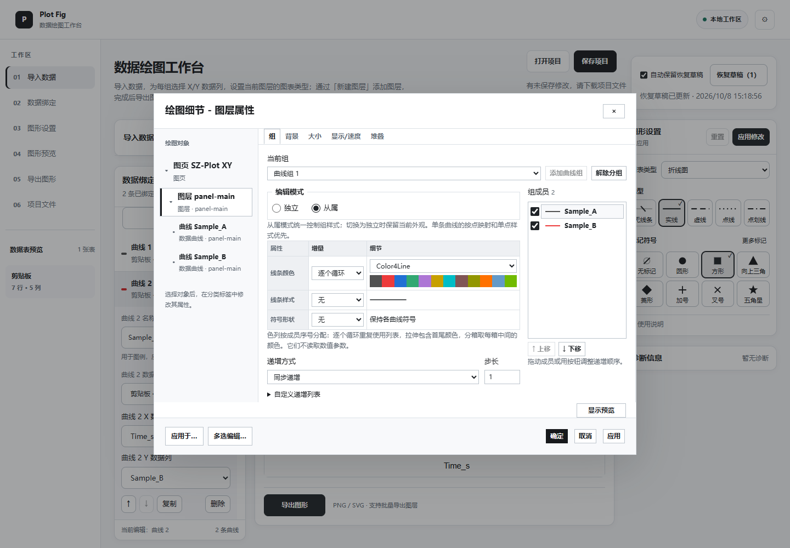

图 6.2　图层属性的“组”页：建立曲线组并管理成员和递增样式

1. 图形属性 → 选择图层或 XY/面积曲线 → 组 → 添加曲线组。同组成员需要共用坐标轴。
2. 选择从属模式后，按成员顺序递增颜色、线型、符号；设置同步/嵌套、步长或自定义列表。
3. 通过勾选加入或移出成员，用拖动或上移/下移改变组内顺序。切换独立或解除分组后保留当前外观再单独编辑。
4. 连续着色时，在“线条颜色”选择“数值映射”，来源选曲线序号或每条曲线的数值参数。
5. 输入参数名、单位和各曲线数值，按需设置固定范围、反转色带和显示组色标，再应用。

| 分配方式 | 含义与例子 |
| --- | --- |
| 逐个循环 | 依成员顺序循环离散色列，超过列表长度后重复。 |
| 拉伸色列 | 成员数与色列长度不同也覆盖首尾色。 |
| 分箱色列 | 按分箱中间位置取离散颜色。 |
| 数值映射 | 温度 500、550、1000 按真实差值取连续色，前两条颜色更接近。 |

#### 从数值列名读取参数

选择“从数值列名读取参数”，核对每条曲线的 Y 列名与读取结果，点击“写入 N 个参数”。只接受完整有限数值（可含正负号、小数、科学计数法）；Sample_01、500 K 不会自动提取数字。失败项保留原参数，成功项写入属性草稿，仍需应用。修改列名不会自动更新参数，需重新读取。

组色标复用同一色带、范围和反转；默认关闭。标题未设置时用组名，显式留空可隐藏标题。参数绑定曲线 ID，重排不改变归属；缺失参数保留基础颜色并提示。所有参数相等时取色带中点。多个色标空间不足会阻止应用，需扩大图层或减少色标。

> 曲线组用于统一样式；堆叠子组用于偏移与累积，两者不能混为一谈。同一曲线最多属于一个曲线组，可手动配置父组关系但不能循环嵌套。完整模板保存组配置，仅样式模板保留目标原有组配置。

<a name="s11"></a>

### 6.4 堆叠、偏移、倍率与子组

入口：图形属性 → 左侧选择图层 → 堆叠。当前版本支持六种模式，选择前先确认成员曲线与坐标轴。

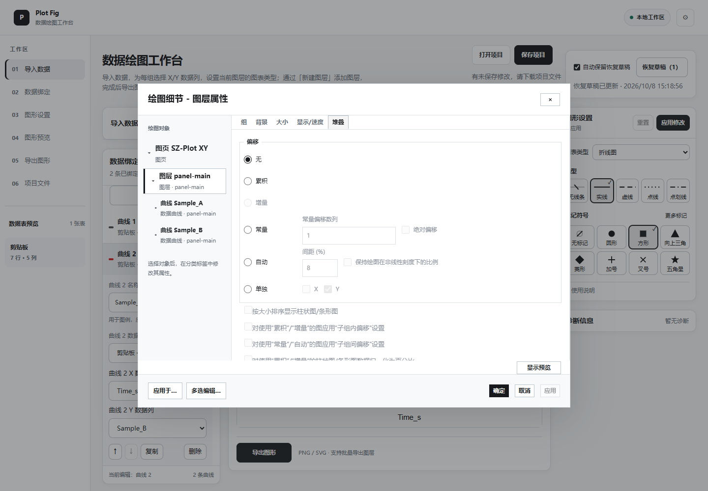

图 6.3　当前版本堆叠页：无、累积、增量、常量、自动、单独

| 模式 | 操作与结果 |
| --- | --- |
| 无 | 关闭这一层的堆叠模式，恢复未堆叠显示。 |
| 累积 | 按成员累加；普通曲线要求线性 Y 轴。柱图可排序、百分比归一化、显示总标签。 |
| 增量 | 用于柱/条图的增量浮动展示；可显示被覆盖的柱/条。普通曲线不开放此模式。 |
| 常量 | 输入偏移数列。未勾“绝对偏移”时循环累加；输入 10 得到 0、10、20…；输入 0 10 得到 0、0、10、10、20… |
| 绝对偏移 | 按数列循环赋值，第一条也应用第一项；0 10 得到 0、10、0、10… |
| 自动 | 按数据跨度与间距（默认 8%）错开；提供“保持绘图在非线性刻度下的比例”选项，按当前轴检查预览。 |
| 单独 | 选曲线后设置 X/Y 偏移值与倍率；柱图的类别方向受限，以可用控件为准。 |

1. 对于多组光谱，可先批量选 Y 建立曲线，然后在堆叠页选择“自动”，调整间距。
2. 需要精确位置时切换“单独”，逐曲线检查 X/Y 偏移与倍率；改变模式后核对预览，不假设所有设置完全相同。
3. 需要分组堆叠时设置成员所属子组，再启用“子组内偏移”或“子组间偏移”。
4. 柱图按需启用大小排序、排序方向、百分比、连接线和总标签；可用性由模式与图型决定。
5. 应用后检查坐标范围。固定范围可能截断偏移后的曲线，必要时恢复自动范围。

> 堆叠、偏移和倍率改变显示，不覆盖原表数值。非线性尺度下应检查保持比例选项及定义域；出现不支持提示时改变模式或尺度。“应用于…”中的曲线堆叠会复制相关堆叠配置，提交前核对目标图层。

<a name="s17"></a>

### 6.5 文字、公式、图例与图形标注

#### 文字与公式

图页的“图例/标题”集中管理曲线图例条目；轴标题在轴属性中设置；独立文字在图页“注释”页添加。文字可调字体、大小、颜色、旋转，以及行对齐、内距、换行、行距、背景和边框。

| 文本模式 | 示例与效果 |
| --- | --- |
| 自动识别 | 裸下划线和 ^ 保留原样；带花括号的 _{...} / ^{...} 表示上下标。 |
| 纯文本 | 列名 Sample_A 需要完全按原样显示时可明确选此模式。 |
| 上下标/富文本类选项 | 按界面提供的模式与语法输入；编辑后看预览，不使用 HTML 标签。 |
| LaTeX 公式 | 自动模式识别 $...$、\(...\) 或以 LaTeX 命令开头的内容；例如 $x^{2}$。用于数学排版，不执行公式计算。 |

#### 添加注释

1. 图形属性 → 图页 → 注释，选择文字、线/箭头、矩形、参考线或跨图层图例，添加对象。
2. 选择页、图层或数据坐标空间，再填写位置、尺寸/端点、文本或样式。数据坐标需要指定所在图层和坐标轴。
3. 跨图层图例选择条目与布局；参考线核对方向与数值，矩形可作为区域强调。
4. 展开预览，确认注释没有挡住数据；应用并保存项目。

#### 直接在画布编辑

双击轴标题或图例文字可原位编辑：单行 Enter 提交，Esc 取消；多行图例 Ctrl+Enter 提交。页/图层坐标的图例与文字可拖动；选中后方向键移动 1 个屏幕 CSS 像素，Shift+方向键移动 10 个。位置按预览比例换算并随项目保存。

> 拖动中按 Esc、切换图层、失去指针捕获或改变窗口大小会取消移动。框选放大模式的拖动用于缩放；有待应用设置或属性窗口时先处理草稿。数据坐标注释通过属性调整。默认图例首次移动后会成为可保存对象并保留当时条目。

<a name="s54"></a>

### 6.6 曲线显示、线条、颜色与填充

入口：**图形属性 → 选中 XY 曲线**。属性窗口中的修改需应用/确定；其他入口按本行说明提交。取消属性窗口只放弃尚未应用的部分。

| 编号 / 功能 | 操作方法 | 结果检查 |
| --- | --- | --- |
| F021 曲线可见性 | 显示页勾选显示曲线。 | 隐藏后原数据仍在，不参加可见图例和范围计算。 |
| F022 曲线轴分配 | 显示页选择 X/Y 轴，必要时使用创建上轴/右轴入口。 | 曲线对应轴标题、量纲与范围正确。 |
| F023 图例文字与格式 | 显示页设置图例条目、普通文字/上下标/LaTeX。 | 自动模式保留裸下划线，带花括号才触发上下标。 |
| F024 学术配色 | 显示/相关外观页搜索或筛选可用配色，选色再应用到当前曲线。 | 配色选择不等于更改图表类型。 |
| F025 线宽与基本颜色 | 线条页设置 pt 线宽、固定颜色。 | 导出后细线可见。 |
| F026 自定义虚线 | 线型选自定义虚线，输入线段/间隔列表与相关参数。 | 不是把任意文字作为线型，检查预览的节奏。 |
| F027 线端、拐角、尖角限制 | 选择平/圆/方线端，尖/圆/斜连接，调整尖角限制。 | 陡转角无异常长尖刺。 |
| F028 线条透明度 | 按百分比设置；0% 不透明。 | 不要与背景 0–1 不透明度字段反向使用。 |
| F029 首尾连接 | 勾选首尾直线连接，闭合曲线轮廓。 | 最后一点到第一点的线确实具有含义。 |
| F030 符号周围留白 | 打开留白并调整可用间隔。 | 线条在符号附近不穿透边框。 |
| F031 曲线箭头 | 选首端/末端/两端/等距重复，设置长度、角度、重复间距及弯曲容忍。 | 箭头方向由原曲线路径决定。 |
| F032 箭头跟随颜色 | 勾跟随线条或改固定颜色。 | 按点颜色映射时检查箭头与线是否一致。 |
| F033 线条与符号层次 | 勾选线条绘制在符号前方。 | 粗线是否遮挡符号中心。 |
| F034 固定/按点/按曲线颜色面板 | 打开线条颜色面板，在不同模式中选色列或连续色带。 | 按曲线可影响整层 XY；按点作用于当前曲线。 |
| F035 整层连续配色 | 按曲线使用连续色带，使首尾曲线对应色带两端。 | 已有组映射会改为全图层曲线顺序；隐藏曲线保留颜色位置。 |
| F036 按点顺序色列 | 线条颜色映射选递增，修改色列。 | 每段采用起点颜色，不是每条曲线一种颜色。 |
| F037 按连续列着色 | 选连续映射与数值列，指定或取消输入范围。 | 超范围夹到端点，范围与色条含义一致。 |
| F038 按分类列着色 | 选分类映射与类别列，编辑颜色列表。 | 类别数超过色数时检查重复颜色。 |
| F039 X/Y 曲线偏移 | 线条页下方启用偏移，选常量、自动、显式列表或元数据方式。 | 偏移改变显示与范围，原表数值保留。 |
| F040 偏移序号范围 | 设置按图层/组等当前可选序号范围计算。 | 成员重排后自动偏移位置可能改变。 |
| F041 曲线下填充 | 线条页勾曲线下填充区域，新增图案页。 | 勾选后才出现该页签。 |
| F042 填充到基线/曲线 | 图案页设基线，或选择同轴目标曲线。 | 正负方向颜色与目标线相对位置正确。 |
| F043 填充图案 | 选择斜线/交叉等可用图案，设置颜色、线宽、间距和透明度。 | 图案不要掩盖数据线。 |
| F044 恢复默认高级线条样式 | 点击恢复按钮，再应用。 | 只按该按钮覆盖的高级线条范围恢复；想全退用取消或全局撤销。 |

<a name="s55"></a>

### 6.7 符号、三类映射与单点覆盖

入口：**图形属性 → XY 曲线 → 符号**。属性窗口中的修改需应用/确定；其他入口按本行说明提交。取消属性窗口只放弃尚未应用的部分。

| 编号 / 功能 | 操作方法 | 结果检查 |
| --- | --- | --- |
| F045 基本符号 | 选择形状、pt 大小、填充、边框、宽度及透明度。 | 无填充可生成空心符号。 |
| F046 更多标记 | 主界面更多标记展开后选择较少用的几何形状。 | 与属性页当前形状一致。 |
| F047 数据单位固定尺寸 | 启用后选 X 或 Y 数据单位并填尺寸。 | 缩放后屏幕像素大小会改变。 |
| F048 仅填充透明 | 选择仅填充使用符号透明度。 | 边框仍按自身设置清晰显示。 |
| F049 边框按半径缩放 | 启用并填半径百分比。 | 不同大小符号的边框随之变化。 |
| F050 字符符号 | 启用字符，选固定字符或循环字符序列，设置字体和字符轮廓。 | 使用本机实际可用字体。 |
| F051 重合点展开 | 开启，选展开方向与间距；按需标出真实位置。 | 展开只改善辨认，不改变真实坐标。 |
| F052 颜色映射 | 启用颜色映射，选择连续渐变或分类轮换，选择数据列。 | 数值列用连续，类别列用分类。 |
| F053 颜色作用对象 | 选择填充、边框或两者。 | 另一部分仍保留其基础颜色。 |
| F054 映射色列编辑 | 添加、删除、修改映射颜色。 | 连续至少保留足够颜色形成渐变。 |
| F055 颜色输入范围 | 勾指定范围，填输入起止。 | 多图统一范围才可直接比较色值。 |
| F056 大小映射 | 选择数值列，面积随值或直径随值。 | 两种方式视觉含义不同，论文说明应与设置一致。 |
| F057 大小单位与边界 | 设 pt/X 数据/Y 数据单位和最小最大尺寸。 | 极端值不应盖住整张图。 |
| F058 形状映射 | 选择类别列并编辑形状序列。 | 图例中选有代表性的形状。 |
| F059 映射图例样本 | 启用显示映射图例样本，填原始行和图例符号尺寸。 | 样本来自正确原行。 |
| F060 单点选择 | 输入原始行号，查看该点数据；启用单点覆盖。 | 按原始行定位，不是排序后的第 N 个显示点。 |
| F061 单点可见性与外观 | 覆盖该行形状、大小、颜色、边框或显示状态。 | 单点样式优先于常规映射；仅影响指定点。 |
| F062 清除单点覆盖 | 移除该行或全部覆盖，恢复基础/映射样式。 | 换 X/Y 来源后检查覆盖是否暂停，不能假定原行身份仍相同。 |

<a name="s56"></a>

### 6.8 数据视图、标签、误差与投影线

入口：**图形属性 → XY 曲线 → 显示 / 子集 / 标签 / 垂直线**。属性窗口中的修改需应用/确定；其他入口按本行说明提交。取消属性窗口只放弃尚未应用的部分。

| 编号 / 功能 | 操作方法 | 结果检查 |
| --- | --- | --- |
| F063 行范围 | 显示页启用限定范围，填起始/结束数据行。 | 数据行从数据区起算，与文件表头行分开。 |
| F064 无效点处理 | 选跨过连接或断开。 | 缺失值附近线段符合预期。 |
| F065 排序与重复 X | 选原序/升序/降序；重复值保留全部或原始第一/最后行。 | 往返扫描不要无意按 X 重排。 |
| F066 计算数据来源 | 选择原始数据或处理后所选数据。 | 自动范围/统计是否应忽略隐藏范围。 |
| F067 显示抽样 | 每隔点数或限定总数，设置首尾保留。 | 峰值可能不在抽样点中，科研分析要回看完整数据。 |
| F068 导出抽样 | 勾导出也使用抽样数据。 | 默认导出完整显示范围中的数据；显式开启才抽稀。 |
| F069 固定行数子集 | 子集页启用，选固定行数并填每组行数。 | 每段边界与真实实验分段一致。 |
| F070 分组列子集 | 子集划分选分组列，绑定该列。 | 同组标签正确，按需要断开子集间连线。 |
| F071 标签来源 | 标签页开启标签，选择数值、原行、列或自定义来源。 | 标签读出正确字段。 |
| F072 标签模板 | 选择自定义并按界面支持占位符编辑文本模板。 | 预览中的字段成功替换，不把任意程序当模板执行。 |
| F073 标签数字格式 | 设置固定/科学等格式与精度。 | 不会修改数据精度。 |
| F074 标签位置、旋转、偏移 | 设上下左右等位置、角度、X/Y 偏移及 pt/字号百分比单位。 | 偏移方向与锚点正确。 |
| F075 标签换行与行距 | 填每行字符数、行距倍数。 | 多行不会超出图页。 |
| F076 标签避让 | 选择允许重叠、隐藏重叠、移动避让。 | 隐藏策略会少显示标签，不代表少了数据。 |
| F077 标签引导线 | 启用，设置色和线宽。 | 移动后的标签能追溯到正确点。 |
| F078 标签背景与边框 | 开启标签框，设背景、描边、内边距。 | 不遮挡关键数据。 |
| F079 标签抽样 | 全部原行、按原行间隔、限定数量或指定原行。 | 只减少标签，不减少曲线点。 |
| F080 逐行标签覆盖 | 选择原始行号，覆盖文字、可见性和偏移。 | 清除覆盖后恢复通用规则。 |
| F081 误差入口 | XY 标签页下方，柱图独立误差页；选 X/Y/值方向。 | 支持图型才显示入口。 |
| F082 对称/非对称误差 | 对称绑定一列，非对称分别绑定负/正两列。 | 误差数值单位与相应轴一致。 |
| F083 误差幅值/端点 | 幅值表示离中心距离；端点表示实际上下端坐标。 | 不能把下界坐标当负误差长度。 |
| F084 方向与基线 | 选两向/单向和参考基线。 | 基线在非线性轴上有效。 |
| F085 误差棒/带/连接 | 选择绘制方式、连接、端帽/避让、线型透明度和填充。 | 误差带是范围，不是额外 Y 曲线。 |
| F086 误差抽样 | 每隔点或限定数目。 | 只影响误差绘制密度。 |
| F087 水平/垂直投影 | 垂直线页分别启用两个方向，选轴/指定值等目标。 | 目标坐标在当前轴定义域内。 |
| F088 投影到曲线 | 高级垂线选同轴目标曲线，按需指定插值位置列表。 | 检查交点，不提供任意曲线拟合。 |

<a name="s59"></a>

### 6.9 曲线组、颜色递增和六种堆叠模式

入口：**图形属性 → 曲线/图层 → 组；图层 → 堆叠**。属性窗口中的修改需应用/确定；其他入口按本行说明提交。取消属性窗口只放弃尚未应用的部分。

| 编号 / 功能 | 操作方法 | 结果检查 |
| --- | --- | --- |
| F124 创建与拆分曲线组 | 在组页选择成员建立组；按需要调整成员、顺序或解除分组。 | 只对目标图层的实际成员生效。 |
| F125 从属/独立编辑 | 选择从属统一递增样式，独立时分别编辑曲线。 | 后续组更新可能覆盖从属成员的局部样式。 |
| F126 组样式递增 | 配置颜色、线型、符号等递增序列和同步/嵌套方式。 | 以组成员顺序逐条检查结果。 |
| F127 子组 | 给成员指定子组及组间递增关系。 | 子组同时可参与堆叠，先检查成员身份。 |
| F128 离散调色板 | 编辑色列，选择循环、拉伸或分箱方式。 | 曲线数大于颜色数时需知道如何复用颜色。 |
| F129 连续参数配色 | 启用数值映射，为每条曲线输入参数，设置色域与色谱。 | 参数是每条曲线的量，不是曲线中每个点的值。 |
| F130 读取组参数 | 从纯数值 Y 列名或指定来源读参数，检查逐曲线匹配。 | 带单位文字的列名不一定能直接转数值。 |
| F131 组色标 | 启用色标，调标题、范围、刻度和布局。 | 用于温度/时间序列等连续组参数。 |
| F132 按曲线配色入口 | 线条颜色菜单选择按曲线调色板。 | 连续应用会按整层序列重建映射；隐藏曲线仍占序号。 |
| F133 无堆叠 | 堆叠模式选无。 | 取消堆叠规则后仍需检查曲线本身的独立变换。 |
| F134 累计堆叠 | 选择累计，按需排序及百分比归一化。 | 后续曲线叠加之前数据；适合有加和意义的量。 |
| F135 增量堆叠 | 柱图选择增量，按需显示重叠部分。 | 该模式限适用柱图，不等于一般 XY 错位。 |
| F136 固定偏移 | 填偏移序列，选累积增量或绝对偏移。 | [10] 增量得到 0/10/20；绝对值列表会循环复用。 |
| F137 自动偏移 | 选择自动，设置间距百分比和保留比例。 | 默认间距 8%，自动根据曲线范围排开。 |
| F138 独立偏移 | 选单条曲线，开启 X/Y 偏移，输入偏移值和倍数。 | 柱图不能沿类别维任意数值偏移。 |
| F139 子组内与子组间 | 组内选累计/增量，组间选固定/自动。 | 先预览一个子组再检查组间位置。 |
| F140 成员、顺序与排序 | 编辑参与曲线与子组归属；适用累计柱图可按值升/降序。 | 排列顺序与图例识别保持一致。 |
| F141 堆叠连线与总标签 | 开启连接线、总标签，设置颜色、字号、格式。 | 总量标签与各段标签区分。 |
| F142 附加线相对基线 | 按需要设置附加线随堆叠偏移。 | 否则辅助线可能停留在未偏移的位置。 |

<a name="s63"></a>

### 6.10 注释、图例与文字排版

入口：**图形属性 → 页面 → 注释；页面图例/标题或曲线图例**。属性窗口中的修改需应用/确定；其他入口按本行说明提交。取消属性窗口只放弃尚未应用的部分。

| 编号 / 功能 | 操作方法 | 结果检查 |
| --- | --- | --- |
| F194 新增注释 | 选择文本、线/箭头、矩形、参考线或跨层图例，再新增。 | 在编辑注释列表中选中目标后继续设置。 |
| F195 显示与删除注释 | 开关显示注释，或删除当前对象。 | 隐藏便于临时比较；保存项目可保留对象。 |
| F196 坐标空间 | 选图页比例、图层比例或数据坐标，再选所属层/轴。 | 比例坐标 0–1；数据坐标使用轴单位，换空间后核对位置。 |
| F197 文本位置和内容 | 填位置、文字、字号、字体、颜色、粗斜体及锚点。 | 中间锚点适合居中注释，末端锚点适合右对齐。 |
| F198 文字格式 | 选自动、纯文本、富文本或 LaTeX；使用格式按钮输入上下标等。 | 以预览验证，不能把任意 HTML 当受支持富文本。 |
| F199 文字布局 | 设对齐、内边距、换行、行距、背景和边框。 | 文字框高度应容纳换行后的内容。 |
| F200 旋转与拖动 | 数值调整文字旋转；在预览中对支持对象拖动定位。 | 数据锚点随轴变换，图页锚点随页面比例定位。 |
| F201 线与箭头 | 填写两端，设置线色/宽/型/透明度、箭头起终点及尺寸。 | 箭头明确指向目标数据，不能把点位移当作数据变化。 |
| F202 矩形区域 | 设置位置、尺寸、填充及边框。 | 用低不透明度突出区域，避免遮住曲线。 |
| F203 注释参考线 | 选 X 常量或 Y 常量，填数据值。 | 只能使用数据坐标；轴统计参考线从轴属性设置。 |
| F204 曲线图例项 | 编辑每条曲线图例文字和可见性，检查样本样式。 | 隐藏图例项与隐藏曲线分别控制。 |
| F205 跨层图例 | 新增图例注释，勾选包含的曲线，设列数、方向和锚点。 | 可合并不同层的说明，删除曲线后需检查成员。 |
| F206 页面标题与图例 | 页面图例/标题页设置全图文字与图例格式。 | 图层标题和页面标题按用途区别使用。 |

<a name="chapter-7"></a>

CHAPTER 07 · 4 个小节

## 第 7 章　坐标轴、尺度与参考线

从尺度和范围开始，再设置刻度、标签、网格、参考线与断点。高级参数表用于按控件名称查阅，操作前先确认目标图层与轴。

学习目标：完成后，检查数据定义域、固定范围、单位和标签；缩放后的可见范围也会影响导出。

**本章小节目录**

- [7.1 坐标轴尺度、范围与重缩放](#s14)
- [7.2 刻度标签、网格、参考线、断轴与轴联动](#s15)
- [7.3 坐标轴尺度、范围与重缩放](#s60)
- [7.4 轴刻度、标签、网格、断点与参考线](#s61)

<a name="s14"></a>

### 7.1 坐标轴尺度、范围与重缩放

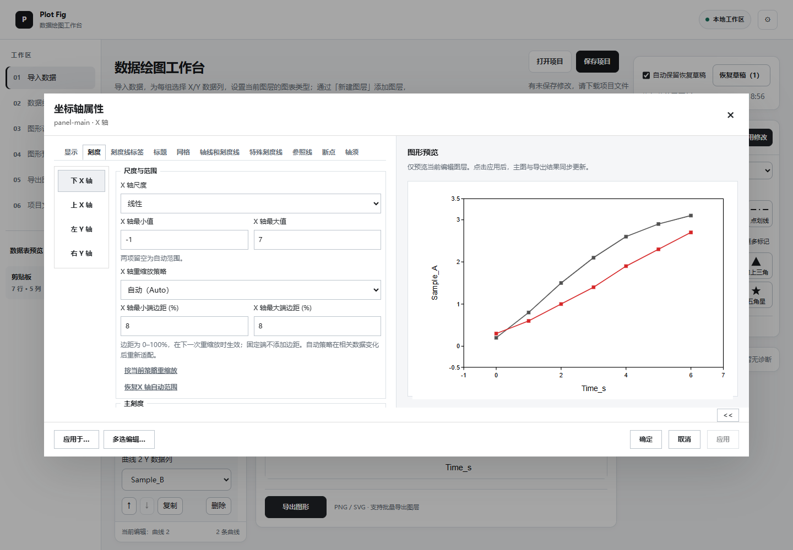

图 7.1　坐标轴窗口：先选下/上 X 或左/右 Y，再编辑刻度与范围

1. 预览工具栏 → 坐标轴 → X 轴或 Y 轴；左侧再选需要修改的具体轴。
2. 在“刻度”页选择尺度，设置最小/最大值与重缩放策略；查看右侧预览。
3. 需要回到数据范围时点击“恢复…自动范围”，或使用“按当前策略重缩放”。
4. 在标题页检查自动列名或手动文字，应用后回到主图。

| 尺度 | 数据要求与用途 |
| --- | --- |
| 线性 | 一般数值；相同数值差对应相同距离。 |
| Log10 / Ln / Log2 | 普通对数要求正值；对跨数量级数据有用。可选对数细分策略，Log10 另有窄区间兼容策略。 |
| SymLog | 先选对数尺度，再勾“对称对数”，设线性范围阈值和线性段长度；用于跨零数据。 |
| Probability / Probit / Logit | 界面使用百分数，数据须处于其有效域；避免 0、100 等变换奇点。 |
| Weibull | 界面使用比例，核对有效域；不要与百分数混用。 |
| 倒数 / 偏移倒数 | 避免分母为零；偏移倒数可设置偏移常数。 |
| Discrete 数值 X | 按离散数值位置处理，不等同于分类字符串轴。 |
| 自定义公式 | 填写正向、反向公式与定义域，须在整个域内单调且互相还原。 |

#### 自动范围与固定范围

Auto 在相关数据变化后适配范围；Fixed 保持当前范围；Normal 和固定一端的组合用于有条件重缩放。两端边距 0–100% 在下一次重缩放时生效，固定端不加边距。换表、堆叠、批绘后范围异常，先检查是否固定。

自定义尺度支持 x、四则运算、^、sqrt、ln、log10、log2、exp、abs。示例正向 `x/1000`、反向 `x*1000` 必须配合有效定义域。仅改变数字显示时用“刻度标签公式”，不要为换标签而改变坐标尺度。

> 刻度标签公式 x/1000 只改变显示文字，原始数值和刻度位置不变。单位转换、尺度变换、标签格式是三件不同的事。

<a name="s15"></a>

### 7.2 刻度标签、网格、参考线、断轴与轴联动

| 页签 / 功能 | 操作与注意事项 |
| --- | --- |
| 显示 | 设置轴可见性、对边轴关系、共享样式以及可用的双 Y 对齐选项；不需要的轴可隐藏。 |
| 主次刻度 | 自动、按增量、按数量、仅端点；按需启用次刻度。密度过大时减少刻度，不用缩小字体硬塞。 |
| 日历刻度 | 时间列选择秒、分、小时、日、周、月、季度、年及间隔；锚点字段按 UTC 毫秒表达。 |
| 指定刻度位置 | 显式输入位置或选择位置数据列；检查列与当前轴的坐标单位一致。 |
| 刻度线标签 | 数值格式、精度、旋转、位置、颜色；高级来源可用数据列、日期格式/时区、列信息、多行标签表及次刻度标签。 |
| 标题 | 自动使用列名或手动输入；设置字号、旋转、偏移、上下标与公式。 |
| 网格 | 分别控制主/次网格、线型、颜色、宽度及区间填色等可用设置。 |
| 轴线和刻度线 | 线宽、颜色、刻度方向、长度、轴线箭头及放置位置。 |
| 特殊刻度线 | 添加指定位置的特殊文字、长度、引线或隐藏某刻度；用于关键阈值。 |
| 参照线 | 设置固定数值线或基于曲线的统计量，指定颜色、标签及区间填色；统计范围需明确。 |
| 断点 | 填写断区起止、间隙、保留区段权重、断轴符号和后续区段设置；不能用断轴隐藏应当解释的数据。 |
| 轴须 | 选曲线显示 Rug 分布标记，设置排列、位置、长度及是否跟随曲线颜色。 |
| 公式轴链接 | 选择源图层/轴，填正逆公式与定义域；联动关系需可逆且不能循环。 |

1. 先确定读者需要看到的数值范围与单位，再配置尺度和刻度。
2. 用标题、刻度格式和网格提高可读性；特殊刻度与参考线只添加真正有意义的标记。
3. 使用多轴、公式联动或断轴后，检查各曲线仍绑定正确轴，并查看导出预览，避免轴文字被裁切。

> 断轴和离散数值轴不支持普通鼠标缩放路径，使用轴属性调整。动态统计参考线与固定数值参考线的含义不同，换数据后应重新核对。

<a name="s60"></a>

### 7.3 坐标轴尺度、范围与重缩放

入口：**双击坐标轴 → 坐标轴属性；或图形属性对象树 → 对应轴**。属性窗口中的修改需应用/确定；其他入口按本行说明提交。取消属性窗口只放弃尚未应用的部分。

| 编号 / 功能 | 操作方法 | 结果检查 |
| --- | --- | --- |
| F143 选择目标轴 | 确认当前图层以及上/下 X、左/右 Y 轴，再编辑。 | 多轴图不能只凭左侧列表第一项判断目标。 |
| F144 尺度类型 | 在刻度设置选择线性、对数或界面提供的高级尺度。 | 更改尺度后重新核对数据定义域、范围及主次刻度。 |
| F145 Log10 / Log2 / Ln | 选择相应底数，范围和数据使用正值。 | 不可显示值的诊断需处理，不能隐藏后当作零。 |
| F146 SymLog | 对数轴开启对称对数，设置线性范围阈值和线性段长度。 | 适合正负跨零数据；零附近线性，远端对数。 |
| F147 对数刻度策略 | 选择等距细分、真实对数细分或 Log10 窄区间兼容。 | 真实 Log10 次刻度 8 对应 2…9。 |
| F148 倒数尺度 | 选择倒数 1/x，设置不跨零的范围。 | 范围不得跨越奇点，注意轴方向和读数。 |
| F149 Probability / Probit / Logit | 选择对应概率尺度，输入百分数数据及严格位于 0–100 的范围。 | 50 表示 50%，不能把 0.5 当作 50%。 |
| F150 Weibull 尺度 | 选择 Weibull，输入比例数据，范围严格位于 0–1。 | 与百分数尺度不同，0.5 表示 50%。 |
| F151 Discrete 数值 X | 数值 X 选择 Discrete，按离散位置展示。 | 用于离散横坐标；不是数据列类型的通用转换。 |
| F152 平移倒数 | 选择平移倒数并输入 offset。 | 奇点为 x=-offset；默认值需按实际单位核查。 |
| F153 自定义尺度 | 输入正函数、逆函数、定义域，例如 2*x 与 x/2。 | 整个定义域必须单调且正逆互相还原。 |
| F154 公式语法 | 只使用 x、四则运算、^、sqrt、ln、log10、log2、exp、abs。 | 不支持任意 JavaScript 或外部脚本。 |
| F155 手动范围与反向 | 填上下界，按需开启反向。 | 轴方向变化不改原始数据顺序。 |
| F156 重缩放策略 | 选常规、自动、固定，或固定最小/最大端的常规/自动。 | 自动跟随数据变化，固定用于跨图统一但可能裁掉新值。 |
| F157 端点边距 | 设置最小/最大端 0–100% 边距，再按当前策略重缩放。 | 固定端不添加边距，设置并非立即修改所有轴。 |
| F158 分类顺序 | 分类轴选首次出现、升序、降序或自定义类别列表。 | 实际类别与自定义项拼写一致。 |
| F159 日历刻度 | 日期轴设置日历单位、步长和锚点。 | 锚点为 UTC 毫秒；显示时区与原始数据解释需一致。 |
| F160 X:Y 数据比例 | 启用关联轴长，选择线性 X/Y 轴，比例设 1 得到等单位长度。 | 调整绘图区轴长，数据范围保持；不适用组合界面会提示。 |

<a name="s61"></a>

### 7.4 轴刻度、标签、网格、断点与参考线

入口：**坐标轴属性 → 对应同名页签**。属性窗口中的修改需应用/确定；其他入口按本行说明提交。取消属性窗口只放弃尚未应用的部分。

| 编号 / 功能 | 操作方法 | 结果检查 |
| --- | --- | --- |
| F161 轴显示和标题 | 显示页开关轴；标题页输入物理量/单位并设置字体、位置、旋转。 | 关闭轴后确认曲线仍按正确轴映射。 |
| F162 主次刻度生成 | 刻度页设置数量或步长，选择自动、手动数值列表或数据列定位。 | 密集刻度会挤压标签。 |
| F163 轴线和刻度线 | 设置轴线色/宽、主次刻度长度、方向和外观。 | 朝内/外方向应与页面留白匹配。 |
| F164 轴放置位置 | 按边界或可用定位方式设置轴线位置和偏移。 | 穿过数据区的轴线可能覆盖曲线。 |
| F165 数字标签 | 设记数法、精度、前后缀、字体、角度及偏移。 | 数值显示格式不改变坐标值。 |
| F166 标签来源列 | 标签来源选列；需要时选择位置匹配列。 | 位置和标签来自对应的行，不能只按列表长度猜配对。 |
| F167 日期标签 | 选择日期来源、格式和时区。 | 同一时刻可能在不同时区显示不同日期。 |
| F168 元数据标签 | 选索引、名称、单位、表名、最小/最大或起止等元数据。 | 确认对应的数据列与表来源。 |
| F169 多行标签表 | 启用标签表、添加行，选择各行内容和标题、间距。 | 给多行表预留底部空间。 |
| F170 次刻度标签 | 开启次标签，设置字体和颜色。 | 只在需要精细读数时启用。 |
| F171 网格线 | 分别开关主、次网格，设置线色、线宽和线型。 | 网格应易读且不掩盖观测点。 |
| F172 特殊刻度 | 添加位于最小/最大/指定值的刻度，设标签、长度、引导长度或隐藏。 | 适用于标明阈值和关键时间点。 |
| F173 轴线箭头 | 选起点、终点或两端箭头。 | 方向与轴反向状态一致。 |
| F174 常量参考线 | 参照线页添加常量，输入值、标签与样式。 | X 常量为竖线，Y 常量为横线。 |
| F175 统计参考线 | 选择数据曲线、均值/中位数/标准差/分位数及全量/可见域。 | 分位数使用 0–1；范围变化是否影响统计由域选择决定。 |
| F176 参考线标签和区域 | 开启数值，调标签位置；选择成对/交替区域填充及透明度。 | 先核对参考线先后顺序。 |
| F177 断点区间 | 添加 from/to，设置间隙百分比、分段权重和断点符号。 | 断点隐藏区间会改变直观长度，应在报告中清楚显示。 |
| F178 断点后尺度 | 按需设后段尺度、主步长、次刻度数、记数法与精度。 | 跨段比较不能按屏幕长度直接读比例。 |
| F179 轴须（Rug） | 勾来源曲线，选原始/显示数据、重叠/堆叠、内/外侧和长度。 | 每根小线代表样本位置，需区分统计密度曲线。 |

<a name="chapter-8"></a>

CHAPTER 08 · 10 个小节

## 第 8 章　模板复用、批量绘图与导出

先完成并应用代表图，再选择复用方式。本章依次说明格式复制、模板管理、六种批量练习，以及 SVG/PNG 输出设置。

学习目标：完成后，逐项核对映射和预览，检查批次报告与 ZIP 清单；图像文件和可编辑项目分别保留。

**本章小节目录**

- [8.1 复制格式、应用于与多选编辑](#s19)
- [8.2 模板保存、JSON 迁移与 Origin 原生导入](#s20)
- [8.3 按数据表批量绘图与输出项目](#s21)
- [8.4 一张表的多个 Y 列](#s47)
- [8.5 多个文件自动生成独立图形](#s48)
- [8.6 异名列手动映射](#s49)
- [8.7 模板与格式范围](#s50)
- [8.8 取消、重试、ZIP 验收](#s51)
- [8.9 一个图页的多个图层分别导出](#s52)
- [8.10 SVG、PNG 与逐图层批量导出](#s22)

<a name="s19"></a>

### 8.1 复制格式、应用于与多选编辑

1. 预览工具栏打开“复制格式”，选择要复制的范围。
2. 切换目标后打开“粘贴格式”，选择对应范围并检查效果。
3. 在属性窗口使用“应用于…”把当前属性分类复制到目标对象；核对图页、图层、曲线或轴，避免误选整组。
4. 多个对象需要一起修改时使用“多选编辑…”，只提交共同适用的字段，先检查差异与不可用项。

| 机制 | 适合场景 |
| --- | --- |
| 复制 / 粘贴格式 | 当前工作期间快速统一外观。 |
| 应用于… | 把刚调好的某一类属性分发到其他对象，例如线条、字体、堆叠。 |
| 多选编辑 | 同时设置多个选中对象支持的属性。 |
| 仅样式模板 | 跨项目或长期复用一套样式。 |
| 完整模板 | 复用数据槽、图层、坐标轴和图形结构。 |

> 格式复用不等于更换数据。不同对象支持的字段不同，禁用字段不能强行应用；修改后检查目标轴范围、图层位置与组配置是否仍符合预期。

<a name="s20"></a>

### 8.2 模板保存、JSON 迁移与 Origin 原生导入

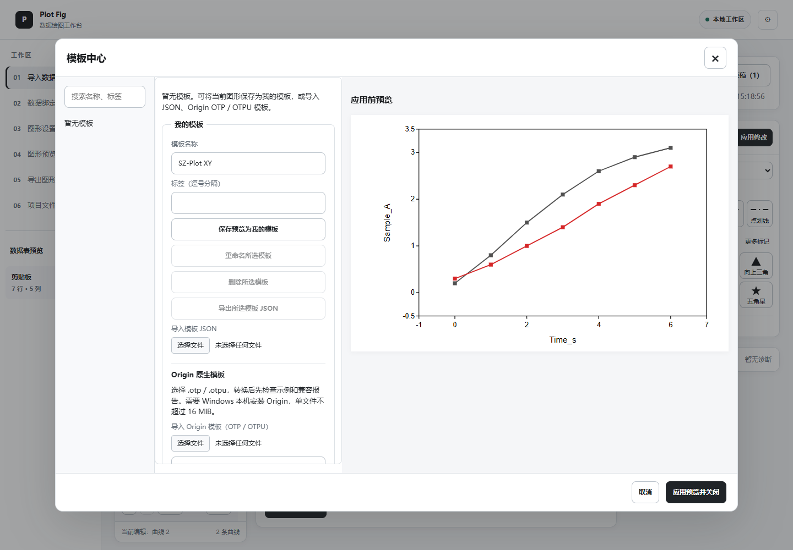

图 8.1　模板中心：当前初始模板库为空，可先保存自己的图形或导入模板

#### 创建与管理个人模板

1. 先完成并应用一张有效图形，打开模板中心。填写模板名称与逗号分隔标签，点击“保存预览为我的模板”。
2. 选择已有模板，可搜索、重命名、删除或导出 JSON。跨设备之前先导出备份。
3. 导入模板 JSON 后，选择仅样式或完整模板；配置完整模板的数据槽，生成模板预览。
4. 检查预览后点击“应用预览并关闭”；取消放弃未应用内容。

| 套用范围 | 结果 |
| --- | --- |
| 仅样式 | 复用样式，尽量保留目标结构与数据；组配置保留目标原有设置。 |
| 完整模板 | 复用模板结构和格式；必需数据槽必须映射到有效列，逐层检查。 |

模板保存在当前站点的浏览器 IndexedDB；清理站点数据会丢失。模板用于复用样式/结构；完整工作数据用 .plotfig.json 保存。当前没有预置期刊模板列表，不能依赖旧手册中的预设。

#### Origin OTP / OTPU

1. 在本机 Windows 上通过 Vite dev 或 Vite preview 运行编辑器，确保已安装并可正常启动 Origin。
2. 模板中心 → 我的模板 → Origin 原生模板，必要时先“检测 Origin 导入服务”，选择 .otp/.otpu（最多 16 MiB）。
3. 等待独立 Origin 会话转换；支持取消。查看示例图与兼容提示。
4. 点击“保存导入模板”，新模板自动选中，再按仅样式或完整模板映射自己的数据。保存模板本身不替换当前图形。

> 原生转换只在本机处理，静态网页没有本机转换接口。映射范围包括可支持的折线、散点、线加符号、柱条、面积与部分堆叠；复杂分组、特殊字体/标注可能有差异。含可执行脚本、自定义表达式或需求值标签的模板会拒绝导入，不能承诺无损复刻。

<a name="s21"></a>

### 8.3 按数据表批量绘图与输出项目

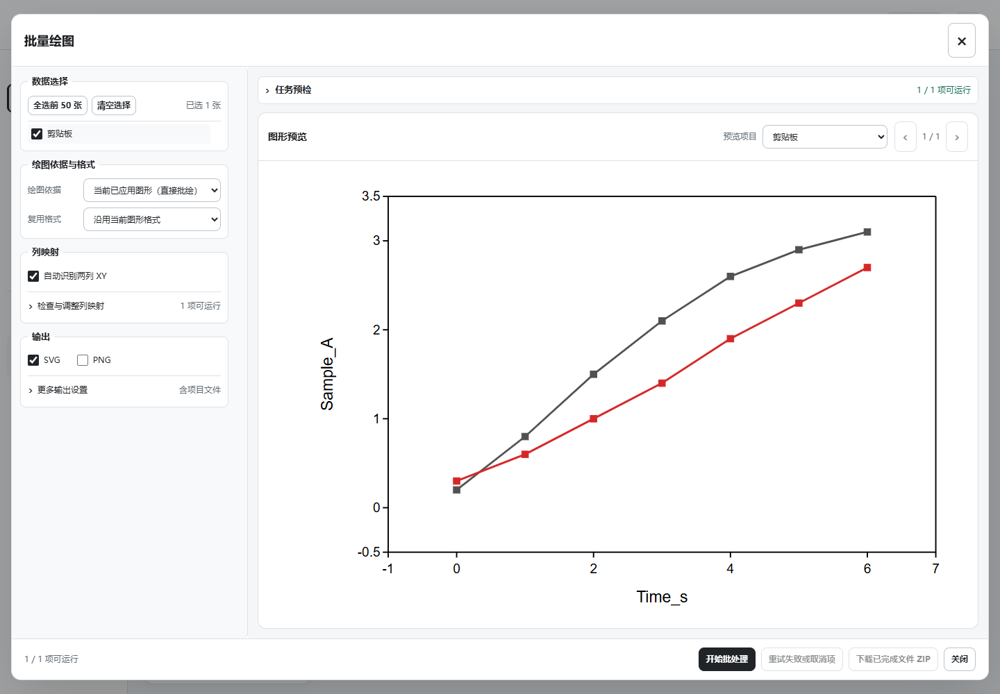

图 8.2　数据表批绘：左侧数据、格式与输出设置，右侧逐项预览

1. 导入结构相似的多张数据表，先完成一张代表图，并应用或重置所有待绘图设置。
2. 预览工具栏“模板”分组 → 数据表批绘，勾选数据表。默认绘图依据是“当前已应用图形（直接批绘）”，无需先保存模板。
3. 设置复用格式；展开手动映射检查 X/Y 等必需角色。预览项目下拉框及上一项/下一项可逐表检查。
4. 选择 SVG、PNG；在更多输出中按需要包含可重新打开的项目。
5. 开始批处理；完成后下载已完成文件 ZIP。失败或取消项可重试，成功文件保留。

| 选项 | 行为 |
| --- | --- |
| 自动识别两列 XY | 优先手动映射、同名列，再识别 X/Y 表头，仍不匹配时用第一列 X、第二列 Y；X 可为数值/日期/日期时间，Y 必须为数值。 |
| 多曲线换两列表 | 单图层同轴多条 XY 无法完整匹配时，可保留第一条及其样式，避免重复绘制同一 Y。关闭自动识别可恢复严格匹配。 |
| 复用格式 | 沿用当前图形格式、所有样式格式、所有格式、自定义格式。 |
| 自定义格式 | 可选页面背景、已有图层图例格式、图层背景、图层尺寸、刻度与范围、颜色、字体；未选项保留目标设置。 |
| 刻度与范围 | 选中或使用所有格式时复用源范围；否则换表按重缩放策略适配。固定范围可能截断新表数据。 |
| 完整模板 | 必须配置必需槽；原图依赖多张表时，按表批次也要逐项确认所有映射。 |

批绘不会修改当前工作区。图层按顺序对应，来源不足时循环复用；复用尺寸保留目标位置，复用范围保留目标轴标题。自动标题随新列名更新，手动标题保持。预览、图片与项目使用相同格式选择，修改配置后旧结果清空，需要重新运行。

> 每批最多 50 项，输入不超过 100 MiB，输出不超过 200 MiB；ZIP 内含序号、安全文件名与 manifest.json。批次状态不跨会话保存。复杂图型、重复列名、多列或类型错误需显式映射。每项绑定一张表不代表能自动解决原图所有跨表依赖。

<a name="s47"></a>

### 8.4 一张表的多个 Y 列

目标：一张图中叠加多个 Y；输出是一张多曲线图。练习数据为 [07-multi-axis.csv](examples/07-multi-axis.csv)。

1. 导入数据，图型保持折线图，共用 X 选 X。
2. 打开批量选择 Y 列，清空选择后仅勾 A、B、C、D，添加所选曲线。
3. 生成图形；如果量级差异太大，使用独立多轴、分层，或明确需要的归一化处理。
4. 多组光谱需要错开时，图层属性 → 堆叠 → 自动，设置间距，再到组页递增颜色。
5. 同一数据列无需重复添加；已有同轴 X/Y 绑定会跳过。修改仍在待绘图阶段时可以整体重置。

| 期望 | 检查 |
| --- | --- |
| 曲线数 | 4 条；原始数据表不变。 |
| 名称和顺序 | A、B、C、D 按原表列顺序。 |
| 输出 | 保存一个项目，导出一张图。 |

> 批量选 Y 不会自动为每个 Y 导出单独文件。需要逐张结果时，把数据组织为多表批绘，或建立多个图层再逐层导出。

<a name="s48"></a>

### 8.5 多个文件自动生成独立图形

目标：让两个同结构文件复用同一绘图格式，分别输出。可以从零导入 01-xy.csv 与 06-xy-repeat.csv；也可打开 [批绘练习起点](examples/projects/batch-start.plotfig.json)，其中另附一张异名列数据表供下一节练习。

1. 多选导入 01-xy.csv 和 06-xy-repeat.csv，预览中各选第一张表，确认导入。
2. 先在第一张表上做好 Time_s / Sample_A、Time_s / Sample_B 两条曲线，应用修改。
3. 点击数据表批绘，只勾选这两张表；绘图依据保持“当前已应用图形（直接批绘）”。
4. 复用格式选沿用当前图形格式；自动识别两列 XY 保持开启，同名列优先匹配，因此本例仍保留两条曲线。
5. 切换预览项目，确认第一项终点 3.1/2.7，第二项终点 5.3/3.3。
6. 勾选 SVG 与 PNG，展开更多输出设置，PNG 选 300 DPI，勾选包含可重开的项目文件。
7. 开始批处理，等待两项成功，再下载 ZIP。每项应有 SVG、PNG、plotfig.json，另有 manifest.json。

> 左侧是独立滚动区；手动映射、更多输出和批次明细位于折叠区，窗口较小时需在该区域内向下滚动。批处理期间配置被锁定。

<a name="s49"></a>

### 8.6 异名列手动映射

目标：使第三张 07-multi-axis.csv 也采用双曲线格式，第一条绑定 X/A，第二条绑定 X/B。练习起点已有三表。

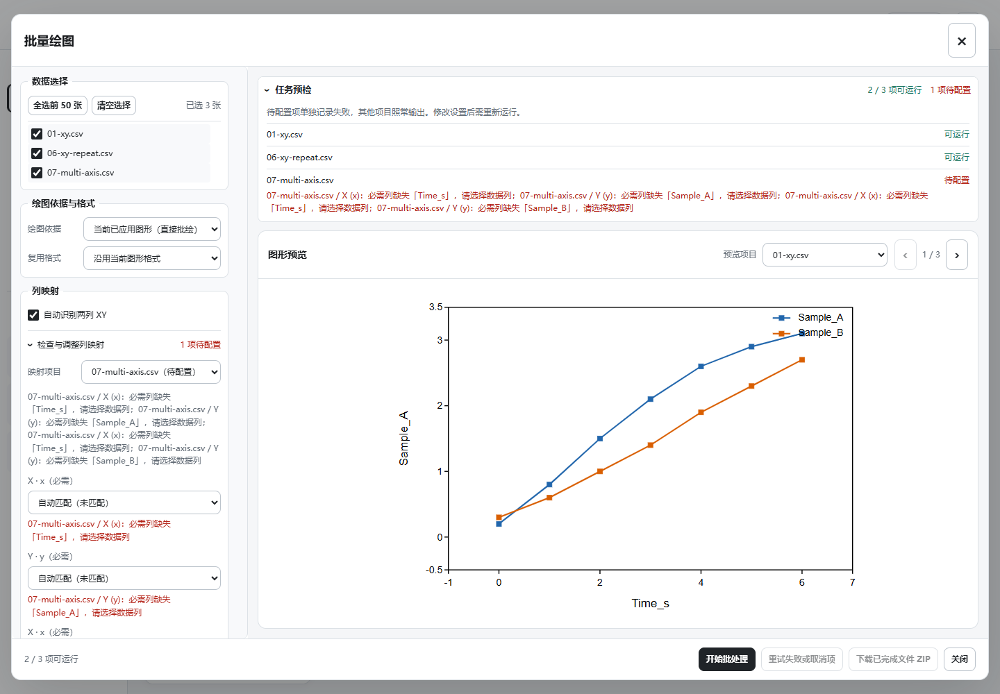

图 8.3　批绘教程 A：第三张表列名不同，预检标为待配置

1. 打开批绘练习起点项目 → 数据表批绘，勾选三张表。第三项由于多列且名称不匹配，进入待配置。
2. 映射项目选择 07-multi-axis.csv；第一个 X 选该表 X，第一个 Y 选 A。
3. 第二个 X 也选 X，第二个 Y 选 B。两个同名“映射 X/Y”控件对应两条不同曲线，按分组顺序检查。
4. 配置完成后映射区可能自动定位其他项目；使用映射项目下拉框回到第三项检查。
5. 预览项目选第三项，确认两条曲线正常、Y 范围覆盖 1–56，再开始批处理。

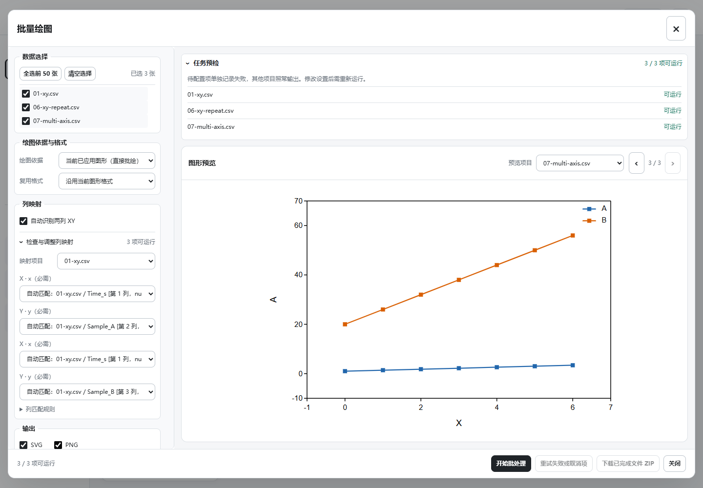

图 8.4　批绘教程 B：第三张表完成映射后的结果预览

| 问题 | 处理 |
| --- | --- |
| 所有表都能按首两列自动匹配吗 | 不能。多列数据和复杂图型需要明确映射；自动识别不是任意智能推断。 |
| 两个 Y 都选成 A | 会重复画同一列；把第二个 Y 改成 B。 |
| 误差/颜色/标签等额外槽 | 也必须检查对应列；主 X/Y 有效不保证额外必需槽有效。 |
| 原图引用多张表 | 按表批绘每项只基于一张目标表，所有必需槽应逐项配置；必要时改用适合批绘的代表图。 |

<a name="s50"></a>

### 8.7 模板与格式范围

1. 先保存一个有代表性的个人模板，或导入模板 JSON。打开数据表批绘，在绘图依据中选择它。
2. 只统一外观选仅样式；连图层/坐标轴结构一起复用选完整模板，并完成所有必需数据槽。
3. 不选模板也能直接选所有样式格式、所有格式或自定义格式。
4. 自定义只勾颜色、字体时，目标轴范围和尺寸保持；勾刻度与范围时，批次会采用来源范围。
5. 修改格式选择后重新运行，旧输出清空；不要把修改前 ZIP 与修改后预览混用。

| 复用项 | 练习方式 / 预期 |
| --- | --- |
| 所有样式格式 | 两张数据范围不同的表统一样式，允许各自自动范围。 |
| 所有格式 | 连尺寸与范围一起复用；第二张表可能有点被裁切，必须检查。 |
| 自定义：颜色、字体 | 只统一这两项，不强制轴范围。 |
| 自定义：图层尺寸 | 复制宽高，保留目标位置。 |
| 图例格式 | 复用已有图层图例的排版，曲线名称来自目标数据/设置。 |
| 完整模板 | 保持完整结构、组设置与数据槽，适合固定结构的系列报告。 |

> “同样式”和“同坐标范围”是不同需求。要做跨样品直接比较可固定范围；只要求风格一致时不要误选会裁剪数据的固定范围。

<a name="s51"></a>

### 8.8 取消、重试、ZIP 验收

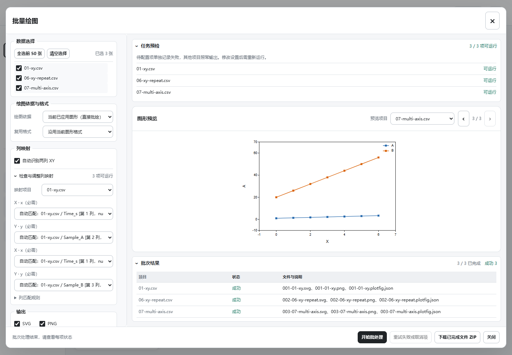

图 8.5　批绘教程 C：三项实际运行成功，每项生成 SVG、PNG 和可重开项目

1. 运行前看预检，必要时展开异常条目；点击开始后查看每项等待、处理中、成功、失败或取消状态。
2. 需要停止时取消；已完成输出可以保留。重试失败或取消项只重新处理这些项。
3. 修改数据选择、映射、格式或输出配置会清空旧结果；修改后从头运行新批次。
4. 下载已完成文件 ZIP，解压后先看 manifest.json 的状态和文件清单。
5. 逐项打开 SVG/PNG 检查范围、图例与字体，再从 ZIP 中选一个 .plotfig.json 用编辑器打开，确认可继续编辑。

完整练习的预期文件为 001-01-xy、002-06-xy-repeat、003-07-multi-axis 三组，每组各有 SVG、PNG 和 .plotfig.json。失败项没有成功图像是正常的错误隔离结果，不能只按 ZIP 是否存在判断全部完成。

> 批次状态不跨页面会话保存；完成后及时下载。每批最多 50 项，输入 ≤100 MiB、输出 ≤200 MiB。批处理不覆盖当前主工作区。

<a name="s52"></a>

### 8.9 一个图页的多个图层分别导出

目标：将当前项目的图层分别输出。可用 [共享横轴示例](examples/projects/stacked-shared-x.plotfig.json)理解图页结构；独立图层适合直接单独导出，联动图层要核对隔离后的含义。

1. 用图层管理创建或复制图层，分别绑定数据；检查各层均有有效图形并应用。
2. 导出图形 → 批量导出图层，勾选要导出的图层。
3. 选择 PNG 或 SVG、文件名、DPI、透明背景；PNG 可取消自动像素后统一宽高。
4. 选中图层预览，确认单层轴、图例与附加对象完整，再执行导出。
5. 下载 ZIP 并检查状态。相互依赖的多轴图要保留完整关系时，应导出当前整张图形。

| 批量入口 | 处理对象 | 结果 |
| --- | --- | --- |
| 批量选择 Y 列 | 同一表的多个 Y | 同图多条曲线 |
| 数据表批绘 | 多张数据表 + 当前图/模板 | 多份独立图像，可附项目 |
| 批量导出图层 | 当前图页中的图层 | 每个选中图层一份图像 |
| 数据批量导入 | 多个文件/工作表 | 多张待绑定数据表，本身不等于完成绘图 |

<a name="s22"></a>

### 8.10 SVG、PNG 与逐图层批量导出

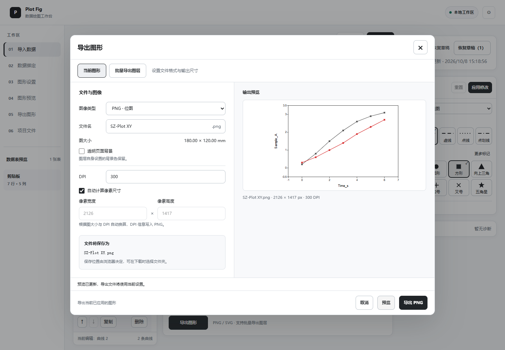

图 8.6　当前导出窗口：PNG/SVG、DPI、自动或手动像素尺寸和输出预览

1. 确认图形已应用，点击“导出图形”。选择“当前图形”或“批量导出图层”。
2. 选择图像类型与文件名；透明页面背景只清除页面背景，图层自身背景仍保留。
3. PNG 输入 DPI，默认自动根据页面物理尺寸计算像素。需要严格尺寸时取消“自动计算像素尺寸”，输入宽高，例如 1600 × 1000。
4. 点击“预览”，查看内容比例和留白。满意后导出；逐层模式先勾选图层，运行后下载 ZIP 并检查每项结果。

| 格式 / 设置 | 用途与限制 |
| --- | --- |
| SVG | 矢量输出，保留页面物理尺寸，适合缩放与进一步排版。依赖目标软件字体与 SVG 支持。 |
| PNG | 位图输出；DPI 为 72–2400 的整数，常用选项 96、150、300、600、1200。 |
| 自动像素 | 像素宽 ≈ 页面宽 mm ÷ 25.4 × DPI，高度同理。 |
| 手动像素 | 每边 1–8192，最多 32,000,000 像素；不同长宽比通过扩展留白保持内容比例。 |
| 批量导出图层 | 将当前图形各选中图层分别输出；使用本窗口当前设置。与按数据表换数据批绘不同。 |

例如页面宽 180 mm、300 DPI，输出宽约 2126 px。相同 DPI 只有在页面物理尺寸也相同时才意味着相同像素尺寸。多张图严格对齐还需要相同字体、轴范围与绘图区边距。

> 当前应用直接提供 SVG、PNG 和 ZIP，不提供原生 PDF/EPS 导出入口。浏览器打印本手册为 PDF 与应用导出科研图形是不同功能。保存图片不会保存可继续编辑的工作区。

<a name="chapter-9"></a>

CHAPTER 09 · 3 个小节

## 第 9 章　项目保存、恢复与故障处理

用项目文件保存可继续编辑的工作，了解自动恢复副本的范围。遇到异常时，按现象定位绑定、草稿、范围、格式或存储问题。

学习目标：完成后，重新打开保存的项目并核对数据与图形；日常操作速查表可帮助定位入口。

**本章小节目录**

- [9.1 项目文件、自动恢复与跨设备备份](#s23)
- [9.2 常见任务配方与排错](#s24)
- [9.3 工作区操作速查](#s64)

<a name="s23"></a>

### 9.1 项目文件、自动恢复与跨设备备份

1. 生成/应用图形，确认属性草稿已提交。点击页面顶部“保存项目”，下载 .plotfig.json。
2. 下次启动编辑器，通过“打开项目”选择文件；检查图形、数据表与绑定。支持的旧版本会迁移，未知新版本或无效数据会提示错误。
3. 关闭或换项目前保存最新文件；图像、模板、项目分别通过各自入口处理。

| 文件或存储 | 保存内容与用途 |
| --- | --- |
| .plotfig.json | 图形模板、工作区数据与绑定；跨设备继续编辑的主要文件。 |
| 模板 JSON | 复用图形结构/外观，经模板中心导入。 |
| SVG / PNG | 排版交付用图像，不替代工作区项目。 |
| 恢复草稿 | 此浏览器此站点中的已应用工作区副本，不跨设备同步。 |
| 原始 CSV / XLSX | 数据来源，留作修正、核查与重新导入。 |

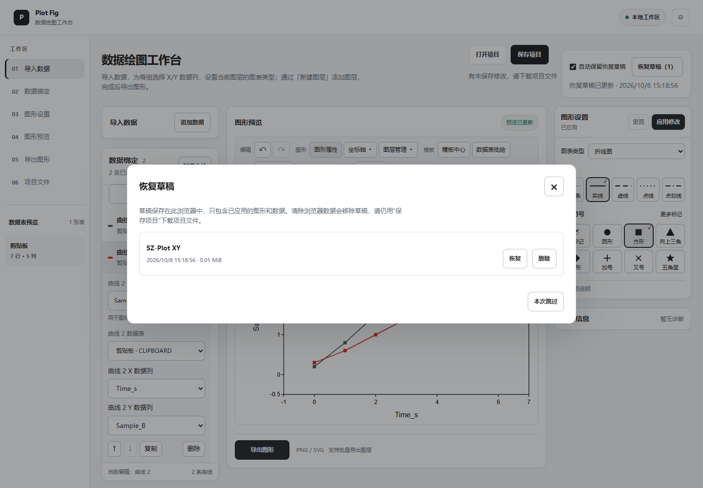

图 9.1　恢复窗口：选择已有副本恢复、删除，或本次跳过

#### 自动保留恢复草稿

默认开启。生成或应用后停止编辑约 2 秒自动保留，持续修改时约每 30 秒内发起一次保存尝试，后台页面可能被浏览器延迟。未应用绘图设置、属性输入及撤销历史不写入草稿。

刷新或重开后在恢复窗口选择副本，也可本次跳过。恢复会清空撤销历史，仍保留未下载提醒；手动下载不会删除恢复副本。同站点最多 3 份，每份不超过 20 MiB，总载荷不超过 60 MiB；满额需逐条清理，不自动淘汰旧副本。

> 关闭自动保留会同步到同站点其他标签页，已有副本仍可恢复或删除。删除当前副本后，需要“重新保留当前工作区”才再次创建。清理浏览器站点数据会移除模板和草稿；存储失败时仍可手动保存与导出。

<a name="s24"></a>

### 9.2 常见任务配方与排错

| 任务 | 最短操作路径 |
| --- | --- |
| 多组 XRD 错开显示 | 导入宽表 → 批量选 Y → 生成 → 图层堆叠选自动 → 调间距 → 组配色 → 保存。 |
| 温度作为整条曲线颜色 | 每个温度一条曲线 → 建从属组 → 数值映射 → 输入温度或从纯数值列名读取 → 显示组色标。 |
| 二维温度强度图 | 导入 04-matrix.csv 类宽表 → 热力图 → 矩阵入口 → 数值列名作为跨列坐标 → 选强度列 → 生成。 |
| 多个文件同样式出图 | 批量导入 → 做好代表图 → 应用 → 数据表批绘 → 检查映射与范围 → ZIP。 |
| 相同像素的报告插图 | 各图导出取消自动像素 → 相同宽高 → 预览 → PNG。再统一绘图区与字体。 |
| 两个量级共同 X | 双纵轴预设 → 分配曲线与 Y 轴 → 设置两边标题/范围 → 检查页面留白。 |
| 继续昨天的工作 | 打开 .plotfig.json；没有手动下载文件时检查同浏览器、同站点的恢复草稿。 |

| 现象 | 优先检查 |
| --- | --- |
| 有数据但没图 | 必需角色有无绑定、列类型是否有效、是否点击生成/应用、诊断是否报错。 |
| 改了属性主图不变 | 当前编辑的是哪个对象，是否仅修改草稿，是否点击应用或确定。 |
| 保存或批绘不可用 | 是否存在待绘图设置、无有效图形、正在执行任务或映射未完成。 |
| 乱码或一整列 | 编码、分隔符；改变批次导入设置后重新勾表和设置行号。 |
| 曲线缺点/错序 | 缺失标记、转换失败、X 排序、重复 X 处理、行范围、子集与抽样。 |
| 曲线或轴文字裁切 | 固定范围、堆叠后偏移、图层裁剪、页面尺寸、多轴预留、色标空间。 |
| Log 或公式报错 | 零负值、奇点、定义域，正逆函数是否单调且互逆。 |
| 模板中心为空 | 当前版本没有内置模板；保存自己的图或导入 JSON/OTP。检查站点是否改变。 |
| 恢复副本不出现 | 浏览器/用户配置/站点端口是否相同、是否关闭保存、配额是否已满；优先打开手动项目文件。 |
| 热图报超限 | X×Y 唯一值组合是否过大；宽表应使用矩阵入口，不把强度当 Y 坐标。 |
| 批绘部分失败 | 查看逐项预检与 manifest；检查必需槽、重复列名、数值类型、范围和输出限额。 |
| 透明导出仍有底色 | 页面透明不移除图层背景；在图层属性中检查背景。 |
| 快捷键无效 | 焦点是否在输入框，是否有弹窗或待应用设置；先提交/取消草稿。 |
| Origin 导入失败 | 本机 Windows、Origin 可启动、同源回环 Vite 服务、16 MiB 文件上限及兼容/拒绝提示。 |

#### 交付前检查

核对数据和单位、图型和曲线数量、误差含义、坐标范围、色标范围、图例对应、文字裁切与输出宽高。保存 .plotfig.json、导出图像，并保留原始数据；批处理检查失败项，而不只看 ZIP 是否下载成功。

<a name="s64"></a>

### 9.3 工作区操作速查

入口：**主界面工具栏、数据工作区及模板中心**。属性窗口中的修改需应用/确定；其他入口按本行说明提交。取消属性窗口只放弃尚未应用的部分。

| 编号 / 功能 | 操作方法 | 结果检查 |
| --- | --- | --- |
| F207 单文件/多文件导入 | 选择 CSV/TSV/TXT/XLSX，批次中勾选文件或工作表，再确认。 | 上限与解析选项见入门章节，XLSX 多表逐项检查。 |
| F208 文本编码与分隔符 | 导入对话框选择编码、逗号/制表符等分隔方式。 | 预览应形成多列且中文正常。 |
| F209 表头/单位/数据起始行 | 分别设置行号，单位行 0 表示不用。 | 重新解析后检查每张表选择状态。 |
| F210 工作区表浏览 | 打开数据工作区，选择表并查看列概要及数据预览。 | 预览只显示部分数据时不代表数据被截断。 |
| F211 列设置 | 选择列，编辑允许的名称、类型、单位、缺失标记等选项，检查转换诊断。 | 日期/数值转换失败会影响绑定。 |
| F212 重新设置导入 | 打开表导入设置，调整解析选项并确认更新。 | 已绑定曲线需重新检查列身份与数据范围。 |
| F213 删除数据表 | 通过表菜单删除，查看绑定依赖影响。 | 先保存项目；被使用的表不能当作无关文件随意移除。 |
| F214 数据槽绑定 | 在曲线或数据绑定入口为每个必需角色选表/列。 | 列名相同仍要确认表来源。 |
| F215 新增/删除曲线 | 按当前图型新增曲线，绑定角色；删除前核对曲线名称。 | 删除曲线不会等同于删除原始数据表。 |
| F216 批量选 Y | 选择同一 X、勾多个 Y，再确认新增。 | 这是一个图里的多曲线；多个独立文件出图用数据表批绘。 |
| F217 生成、应用和重置 | 修改绘图设置后点击生成/应用；放弃草稿用重置。 | 有待应用设置时保存/批绘可能被限制。 |
| F218 属性草稿 | 属性窗口先预览，应用保留窗口、确定提交并关闭、取消放弃未提交内容。 | 批量属性编辑先选对象，再只勾要修改的字段。 |
| F219 撤销/重做 | 使用工具栏或对应快捷键回退已提交编辑。 | 未应用输入不是独立历史；恢复项目会清空历史。 |
| F220 视图缩放 | 用放大、缩小、框选和恢复缩放控件改变可见数据范围。 | 范围会影响图像输出，导出前核对；不改变页面物理尺寸。 |
| F221 诊断信息 | 打开诊断查看对象、字段及错误信息，修复后重新应用。 | 有预览不等于所有绑定均正确。 |
| F222 保存和打开项目 | 保存 .plotfig.json；打开项目恢复数据、绑定及图形。 | 手动备份是跨浏览器/设备继续编辑的依据。 |
| F223 自动恢复开关 | 开启自动保留；恢复窗口选择副本或本次跳过。 | 只保留已应用内容，同站点有容量上限。 |
| F224 恢复副本清理 | 逐条删除不需要的副本；删除当前副本后用重新保留恢复保存。 | 关闭自动保存不等于删除已有副本。 |
| F225 模板保存/管理 | 保存当前预览为个人模板；搜索、改名、删除或导出 JSON。 | 模板与完整项目用途不同。 |
| F226 模板套用 | 选择仅样式或完整模板，映射必需槽，检查预览后应用。 | 完整结构可能改变现有图层。 |
| F227 Origin 原生模板 | 本机满足条件后检测服务，导入 OTP/OTPU，查看兼容提示再保存模板。 | 详见模板章节；本次未在 Origin 中执行转换验证。 |
| F228 数据表批绘 | 选择图形/模板依据、数据表、映射、复用格式和输出；逐项预览再开始。 | 详细跟做步骤见六个批量教程。 |
| F229 批绘取消/重试 | 任务运行中取消；完成后检查逐项报告，重试可重试项，下载成功文件。 | 修改配置会清空旧结果，批次状态不跨会话持久化。 |
| F230 单图/逐层导出 | 导出图形中选择当前图形或批量导出图层，配置 SVG/PNG、DPI 和像素。 | SVG/PNG 不能替代可编辑项目。 |
| F231 透明背景 | 导出中启用页面透明；需要完全透明时也检查各图层背景。 | 页面透明不自动移除图层自身的填充。 |

<a name="chapter-10"></a>

CHAPTER 10 · 2 个小节

## 第 10 章　附录：示例、边界与功能索引

这里集中提供教学文件、容量与兼容边界、逐功能索引和完整练习验收路线。按功能名搜索，或从索引跳回对应参数说明。

学习目标：示例和验证记录用于说明本手册的核对范围；外部 Origin 转换及任意参数组合不在已执行验证的范围内。

**本章小节目录**

- [10.1 示例数据与功能边界](#s25)
- [10.2 功能索引与练习验收](#s65)

<a name="s25"></a>

### 10.1 示例数据与功能边界

以下文件均在 examples 文件夹，使用导入数据入口读取；默认表头行 1、单位行 0、数据起始行 2。

| 文件 | 练习 | 预期 |
| --- | --- | --- |
| [01-xy.csv](examples/01-xy.csv) | 双曲线、映射、误差数据 | 7 行；X=Time_s，Y=Sample_A/Sample_B。 |
| [02-category.csv](examples/02-category.csv) | 柱图、堆叠柱图 | 4 类，A/B 为数值，Error 为误差。 |
| [03-distribution.csv](examples/03-distribution.csv) | 直方图与箱线图 | Value 为样本，Group 为组；两组各 12 条。 |
| [04-matrix.csv](examples/04-matrix.csv) | 矩阵热图、温度组配色 | Angle 坐标，500/550/1000 为三个强度列。 |
| [05-grid.csv](examples/05-grid.csv) | XYZ 热图与等值线 | 3×3 完整等距网格。 |
| [06-xy-repeat.csv](examples/06-xy-repeat.csv) | 与 01-xy.csv 一起批绘 | 同名 X/Y 列、不同数值，比较自动与固定范围。 |

| 限制 | 数值 / 说明 |
| --- | --- |
| 单个数据文件 / 项目文件 | 10 MiB / 20 MiB |
| 导入批次 | 50 文件，合计 100 MiB |
| 表格 | 100,000 行、256 列；工作区 1,000,000 单元格 |
| 图层 | 至少 1、最多 16 |
| 矩阵热图 / XYZ 热图 / 等值线 | 99,999 / 100,000 / 40,000 网格位置 |
| 批绘 | 最多 50 项、100 MiB 输入、200 MiB 输出 |
| 恢复草稿 | 3 份、单份 20 MiB、总 60 MiB |
| PNG | 每边 1–8192 px、总 3200 万像素；DPI 72–2400 |
| Origin 模板 | OTP/OTPU 最多 16 MiB；需本机转换条件 |

#### 可用范围

本手册覆盖当前可用的交互工作流及主要高级参数。菜单资源中保留的灰色 Origin 项不等于完整 Origin 能力：例如 XY 的“分格”未开放。项目不是通用统计分析或拟合软件，不支持将任意 Origin 项目无损导入。内部支持的数据结构并不保证每个字段都有独立界面入口。

当前源代码与旧 README 存在版本差异：本手册采用 Schema 1.24.0、六模式堆叠、当前导出窗口和空初始模板库。普通绘图与截图已在本机运行；Origin 原生转换需要外部软件，本次未执行端到端转换。功能说明的源文件可在附录中定位。

<a name="s65"></a>

### 10.2 功能索引与练习验收

本版包含 231 项按操作入口编排的功能说明。每项均给出怎么用和如何检查；图型另有 21 个从 CSV 到结果的独立教程，批量绘图另有 6 个场景教程。使用 Ctrl+F 搜索按钮名或功能词。

#### 功能索引

| 编号 | 功能 | 详细操作章节 |
| --- | --- | --- |
| F001 | 页面物理宽高 | [5.6 图页与图层参数详解](#s53) |
| F002 | 页面横纵方向 | [5.6 图页与图层参数详解](#s53) |
| F003 | 页面宽高比锁定 | [5.6 图页与图层参数详解](#s53) |
| F004 | 页面变化时图层处理 | [5.6 图页与图层参数详解](#s53) |
| F005 | 内容适配 | [5.6 图页与图层参数详解](#s53) |
| F006 | 名称与描述 | [5.6 图页与图层参数详解](#s53) |
| F007 | 页面纯色/透明/图案 | [5.6 图页与图层参数详解](#s53) |
| F008 | 页面图层列表 | [5.6 图页与图层参数详解](#s53) |
| F009 | 集中图例条目 | [5.6 图页与图层参数详解](#s53) |
| F010 | 图层背景 | [5.6 图页与图层参数详解](#s53) |
| F011 | 图层边框 | [5.6 图页与图层参数详解](#s53) |
| F012 | 图层阴影 | [5.6 图页与图层参数详解](#s53) |
| F013 | 图层名称和可见性 | [5.6 图页与图层参数详解](#s53) |
| F014 | 裁剪开关与余量 | [5.6 图页与图层参数详解](#s53) |
| F015 | 轴与数据前后顺序 | [5.6 图页与图层参数详解](#s53) |
| F016 | 图层位置尺寸 | [5.6 图页与图层参数详解](#s53) |
| F017 | 锁定图层宽高比 | [5.6 图页与图层参数详解](#s53) |
| F018 | 位置尺寸父图层 | [5.6 图页与图层参数详解](#s53) |
| F019 | 叠放顺序 | [5.6 图页与图层参数详解](#s53) |
| F020 | 轴长与数据比例 | [5.6 图页与图层参数详解](#s53) |
| F021 | 曲线可见性 | [6.6 曲线显示、线条、颜色与填充](#s54) |
| F022 | 曲线轴分配 | [6.6 曲线显示、线条、颜色与填充](#s54) |
| F023 | 图例文字与格式 | [6.6 曲线显示、线条、颜色与填充](#s54) |
| F024 | 学术配色 | [6.6 曲线显示、线条、颜色与填充](#s54) |
| F025 | 线宽与基本颜色 | [6.6 曲线显示、线条、颜色与填充](#s54) |
| F026 | 自定义虚线 | [6.6 曲线显示、线条、颜色与填充](#s54) |
| F027 | 线端、拐角、尖角限制 | [6.6 曲线显示、线条、颜色与填充](#s54) |
| F028 | 线条透明度 | [6.6 曲线显示、线条、颜色与填充](#s54) |
| F029 | 首尾连接 | [6.6 曲线显示、线条、颜色与填充](#s54) |
| F030 | 符号周围留白 | [6.6 曲线显示、线条、颜色与填充](#s54) |
| F031 | 曲线箭头 | [6.6 曲线显示、线条、颜色与填充](#s54) |
| F032 | 箭头跟随颜色 | [6.6 曲线显示、线条、颜色与填充](#s54) |
| F033 | 线条与符号层次 | [6.6 曲线显示、线条、颜色与填充](#s54) |
| F034 | 固定/按点/按曲线颜色面板 | [6.6 曲线显示、线条、颜色与填充](#s54) |
| F035 | 整层连续配色 | [6.6 曲线显示、线条、颜色与填充](#s54) |
| F036 | 按点顺序色列 | [6.6 曲线显示、线条、颜色与填充](#s54) |
| F037 | 按连续列着色 | [6.6 曲线显示、线条、颜色与填充](#s54) |
| F038 | 按分类列着色 | [6.6 曲线显示、线条、颜色与填充](#s54) |
| F039 | X/Y 曲线偏移 | [6.6 曲线显示、线条、颜色与填充](#s54) |
| F040 | 偏移序号范围 | [6.6 曲线显示、线条、颜色与填充](#s54) |
| F041 | 曲线下填充 | [6.6 曲线显示、线条、颜色与填充](#s54) |
| F042 | 填充到基线/曲线 | [6.6 曲线显示、线条、颜色与填充](#s54) |
| F043 | 填充图案 | [6.6 曲线显示、线条、颜色与填充](#s54) |
| F044 | 恢复默认高级线条样式 | [6.6 曲线显示、线条、颜色与填充](#s54) |
| F045 | 基本符号 | [6.7 符号、三类映射与单点覆盖](#s55) |
| F046 | 更多标记 | [6.7 符号、三类映射与单点覆盖](#s55) |
| F047 | 数据单位固定尺寸 | [6.7 符号、三类映射与单点覆盖](#s55) |
| F048 | 仅填充透明 | [6.7 符号、三类映射与单点覆盖](#s55) |
| F049 | 边框按半径缩放 | [6.7 符号、三类映射与单点覆盖](#s55) |
| F050 | 字符符号 | [6.7 符号、三类映射与单点覆盖](#s55) |
| F051 | 重合点展开 | [6.7 符号、三类映射与单点覆盖](#s55) |
| F052 | 颜色映射 | [6.7 符号、三类映射与单点覆盖](#s55) |
| F053 | 颜色作用对象 | [6.7 符号、三类映射与单点覆盖](#s55) |
| F054 | 映射色列编辑 | [6.7 符号、三类映射与单点覆盖](#s55) |
| F055 | 颜色输入范围 | [6.7 符号、三类映射与单点覆盖](#s55) |
| F056 | 大小映射 | [6.7 符号、三类映射与单点覆盖](#s55) |
| F057 | 大小单位与边界 | [6.7 符号、三类映射与单点覆盖](#s55) |
| F058 | 形状映射 | [6.7 符号、三类映射与单点覆盖](#s55) |
| F059 | 映射图例样本 | [6.7 符号、三类映射与单点覆盖](#s55) |
| F060 | 单点选择 | [6.7 符号、三类映射与单点覆盖](#s55) |
| F061 | 单点可见性与外观 | [6.7 符号、三类映射与单点覆盖](#s55) |
| F062 | 清除单点覆盖 | [6.7 符号、三类映射与单点覆盖](#s55) |
| F063 | 行范围 | [6.8 数据视图、标签、误差与投影线](#s56) |
| F064 | 无效点处理 | [6.8 数据视图、标签、误差与投影线](#s56) |
| F065 | 排序与重复 X | [6.8 数据视图、标签、误差与投影线](#s56) |
| F066 | 计算数据来源 | [6.8 数据视图、标签、误差与投影线](#s56) |
| F067 | 显示抽样 | [6.8 数据视图、标签、误差与投影线](#s56) |
| F068 | 导出抽样 | [6.8 数据视图、标签、误差与投影线](#s56) |
| F069 | 固定行数子集 | [6.8 数据视图、标签、误差与投影线](#s56) |
| F070 | 分组列子集 | [6.8 数据视图、标签、误差与投影线](#s56) |
| F071 | 标签来源 | [6.8 数据视图、标签、误差与投影线](#s56) |
| F072 | 标签模板 | [6.8 数据视图、标签、误差与投影线](#s56) |
| F073 | 标签数字格式 | [6.8 数据视图、标签、误差与投影线](#s56) |
| F074 | 标签位置、旋转、偏移 | [6.8 数据视图、标签、误差与投影线](#s56) |
| F075 | 标签换行与行距 | [6.8 数据视图、标签、误差与投影线](#s56) |
| F076 | 标签避让 | [6.8 数据视图、标签、误差与投影线](#s56) |
| F077 | 标签引导线 | [6.8 数据视图、标签、误差与投影线](#s56) |
| F078 | 标签背景与边框 | [6.8 数据视图、标签、误差与投影线](#s56) |
| F079 | 标签抽样 | [6.8 数据视图、标签、误差与投影线](#s56) |
| F080 | 逐行标签覆盖 | [6.8 数据视图、标签、误差与投影线](#s56) |
| F081 | 误差入口 | [6.8 数据视图、标签、误差与投影线](#s56) |
| F082 | 对称/非对称误差 | [6.8 数据视图、标签、误差与投影线](#s56) |
| F083 | 误差幅值/端点 | [6.8 数据视图、标签、误差与投影线](#s56) |
| F084 | 方向与基线 | [6.8 数据视图、标签、误差与投影线](#s56) |
| F085 | 误差棒/带/连接 | [6.8 数据视图、标签、误差与投影线](#s56) |
| F086 | 误差抽样 | [6.8 数据视图、标签、误差与投影线](#s56) |
| F087 | 水平/垂直投影 | [6.8 数据视图、标签、误差与投影线](#s56) |
| F088 | 投影到曲线 | [6.8 数据视图、标签、误差与投影线](#s56) |
| F089 | 自动与固定箱数 | [3.12 直方图、箱线图与统计分布参数](#s57) |
| F090 | 固定箱宽 | [3.12 直方图、箱线图与统计分布参数](#s57) |
| F091 | 自定义边界 | [3.12 直方图、箱线图与统计分布参数](#s57) |
| F092 | 分箱尺度 | [3.12 直方图、箱线图与统计分布参数](#s57) |
| F093 | 边界包含 | [3.12 直方图、箱线图与统计分布参数](#s57) |
| F094 | 归一化 | [3.12 直方图、箱线图与统计分布参数](#s57) |
| F095 | 统计标注与柱间距 | [3.12 直方图、箱线图与统计分布参数](#s57) |
| F096 | 四分位算法 | [3.12 直方图、箱线图与统计分布参数](#s57) |
| F097 | 箱体范围 | [3.12 直方图、箱线图与统计分布参数](#s57) |
| F098 | 须范围 | [3.12 直方图、箱线图与统计分布参数](#s57) |
| F099 | 自定义百分位 | [3.12 直方图、箱线图与统计分布参数](#s57) |
| F100 | 均值、中位数与缺口 | [3.12 直方图、箱线图与统计分布参数](#s57) |
| F101 | 置信区间 | [3.12 直方图、箱线图与统计分布参数](#s57) |
| F102 | 原始点与离群点 | [3.12 直方图、箱线图与统计分布参数](#s57) |
| F103 | 连接统计量 | [3.12 直方图、箱线图与统计分布参数](#s57) |
| F104 | 部件独立配色 | [3.12 直方图、箱线图与统计分布参数](#s57) |
| F105 | 叠加分布 | [3.12 直方图、箱线图与统计分布参数](#s57) |
| F106 | 分布参数与采样 | [3.12 直方图、箱线图与统计分布参数](#s57) |
| F107 | 核密度与箱图分布 | [3.12 直方图、箱线图与统计分布参数](#s57) |
| F108 | 热图数据区域 | [4.9 热图、等值线与色标完整设置](#s58) |
| F109 | 单元插值 | [4.9 热图、等值线与色标完整设置](#s58) |
| F110 | 缺失单元 | [4.9 热图、等值线与色标完整设置](#s58) |
| F111 | 单元标签与边界 | [4.9 热图、等值线与色标完整设置](#s58) |
| F112 | 等值线线条/填色 | [4.9 热图、等值线与色标完整设置](#s58) |
| F113 | 等值级别 | [4.9 热图、等值线与色标完整设置](#s58) |
| F114 | 逐级线型覆盖 | [4.9 热图、等值线与色标完整设置](#s58) |
| F115 | 等值线平滑与标签 | [4.9 热图、等值线与色标完整设置](#s58) |
| F116 | 范围外颜色 | [4.9 热图、等值线与色标完整设置](#s58) |
| F117 | Z 色域 | [4.9 热图、等值线与色标完整设置](#s58) |
| F118 | 颜色尺度 | [4.9 热图、等值线与色标完整设置](#s58) |
| F119 | 色谱预设和节点 | [4.9 热图、等值线与色标完整设置](#s58) |
| F120 | 色标显示和标题 | [4.9 热图、等值线与色标完整设置](#s58) |
| F121 | 色标联动/独立 | [4.9 热图、等值线与色标完整设置](#s58) |
| F122 | 色标方向与位置 | [4.9 热图、等值线与色标完整设置](#s58) |
| F123 | 色标刻度与端点 | [4.9 热图、等值线与色标完整设置](#s58) |
| F124 | 创建与拆分曲线组 | [6.9 曲线组、颜色递增和六种堆叠模式](#s59) |
| F125 | 从属/独立编辑 | [6.9 曲线组、颜色递增和六种堆叠模式](#s59) |
| F126 | 组样式递增 | [6.9 曲线组、颜色递增和六种堆叠模式](#s59) |
| F127 | 子组 | [6.9 曲线组、颜色递增和六种堆叠模式](#s59) |
| F128 | 离散调色板 | [6.9 曲线组、颜色递增和六种堆叠模式](#s59) |
| F129 | 连续参数配色 | [6.9 曲线组、颜色递增和六种堆叠模式](#s59) |
| F130 | 读取组参数 | [6.9 曲线组、颜色递增和六种堆叠模式](#s59) |
| F131 | 组色标 | [6.9 曲线组、颜色递增和六种堆叠模式](#s59) |
| F132 | 按曲线配色入口 | [6.9 曲线组、颜色递增和六种堆叠模式](#s59) |
| F133 | 无堆叠 | [6.9 曲线组、颜色递增和六种堆叠模式](#s59) |
| F134 | 累计堆叠 | [6.9 曲线组、颜色递增和六种堆叠模式](#s59) |
| F135 | 增量堆叠 | [6.9 曲线组、颜色递增和六种堆叠模式](#s59) |
| F136 | 固定偏移 | [6.9 曲线组、颜色递增和六种堆叠模式](#s59) |
| F137 | 自动偏移 | [6.9 曲线组、颜色递增和六种堆叠模式](#s59) |
| F138 | 独立偏移 | [6.9 曲线组、颜色递增和六种堆叠模式](#s59) |
| F139 | 子组内与子组间 | [6.9 曲线组、颜色递增和六种堆叠模式](#s59) |
| F140 | 成员、顺序与排序 | [6.9 曲线组、颜色递增和六种堆叠模式](#s59) |
| F141 | 堆叠连线与总标签 | [6.9 曲线组、颜色递增和六种堆叠模式](#s59) |
| F142 | 附加线相对基线 | [6.9 曲线组、颜色递增和六种堆叠模式](#s59) |
| F143 | 选择目标轴 | [7.3 坐标轴尺度、范围与重缩放](#s60) |
| F144 | 尺度类型 | [7.3 坐标轴尺度、范围与重缩放](#s60) |
| F145 | Log10 / Log2 / Ln | [7.3 坐标轴尺度、范围与重缩放](#s60) |
| F146 | SymLog | [7.3 坐标轴尺度、范围与重缩放](#s60) |
| F147 | 对数刻度策略 | [7.3 坐标轴尺度、范围与重缩放](#s60) |
| F148 | 倒数尺度 | [7.3 坐标轴尺度、范围与重缩放](#s60) |
| F149 | Probability / Probit / Logit | [7.3 坐标轴尺度、范围与重缩放](#s60) |
| F150 | Weibull 尺度 | [7.3 坐标轴尺度、范围与重缩放](#s60) |
| F151 | Discrete 数值 X | [7.3 坐标轴尺度、范围与重缩放](#s60) |
| F152 | 平移倒数 | [7.3 坐标轴尺度、范围与重缩放](#s60) |
| F153 | 自定义尺度 | [7.3 坐标轴尺度、范围与重缩放](#s60) |
| F154 | 公式语法 | [7.3 坐标轴尺度、范围与重缩放](#s60) |
| F155 | 手动范围与反向 | [7.3 坐标轴尺度、范围与重缩放](#s60) |
| F156 | 重缩放策略 | [7.3 坐标轴尺度、范围与重缩放](#s60) |
| F157 | 端点边距 | [7.3 坐标轴尺度、范围与重缩放](#s60) |
| F158 | 分类顺序 | [7.3 坐标轴尺度、范围与重缩放](#s60) |
| F159 | 日历刻度 | [7.3 坐标轴尺度、范围与重缩放](#s60) |
| F160 | X:Y 数据比例 | [7.3 坐标轴尺度、范围与重缩放](#s60) |
| F161 | 轴显示和标题 | [7.4 轴刻度、标签、网格、断点与参考线](#s61) |
| F162 | 主次刻度生成 | [7.4 轴刻度、标签、网格、断点与参考线](#s61) |
| F163 | 轴线和刻度线 | [7.4 轴刻度、标签、网格、断点与参考线](#s61) |
| F164 | 轴放置位置 | [7.4 轴刻度、标签、网格、断点与参考线](#s61) |
| F165 | 数字标签 | [7.4 轴刻度、标签、网格、断点与参考线](#s61) |
| F166 | 标签来源列 | [7.4 轴刻度、标签、网格、断点与参考线](#s61) |
| F167 | 日期标签 | [7.4 轴刻度、标签、网格、断点与参考线](#s61) |
| F168 | 元数据标签 | [7.4 轴刻度、标签、网格、断点与参考线](#s61) |
| F169 | 多行标签表 | [7.4 轴刻度、标签、网格、断点与参考线](#s61) |
| F170 | 次刻度标签 | [7.4 轴刻度、标签、网格、断点与参考线](#s61) |
| F171 | 网格线 | [7.4 轴刻度、标签、网格、断点与参考线](#s61) |
| F172 | 特殊刻度 | [7.4 轴刻度、标签、网格、断点与参考线](#s61) |
| F173 | 轴线箭头 | [7.4 轴刻度、标签、网格、断点与参考线](#s61) |
| F174 | 常量参考线 | [7.4 轴刻度、标签、网格、断点与参考线](#s61) |
| F175 | 统计参考线 | [7.4 轴刻度、标签、网格、断点与参考线](#s61) |
| F176 | 参考线标签和区域 | [7.4 轴刻度、标签、网格、断点与参考线](#s61) |
| F177 | 断点区间 | [7.4 轴刻度、标签、网格、断点与参考线](#s61) |
| F178 | 断点后尺度 | [7.4 轴刻度、标签、网格、断点与参考线](#s61) |
| F179 | 轴须（Rug） | [7.4 轴刻度、标签、网格、断点与参考线](#s61) |
| F180 | 新增/复制图层 | [5.7 图层管理、轴关系与格式复用](#s62) |
| F181 | 删除图层 | [5.7 图层管理、轴关系与格式复用](#s62) |
| F182 | 图层顺序 | [5.7 图层管理、轴关系与格式复用](#s62) |
| F183 | 移动曲线 | [5.7 图层管理、轴关系与格式复用](#s62) |
| F184 | 图层内容与绘图设置 | [5.7 图层管理、轴关系与格式复用](#s62) |
| F185 | 网格排列 | [5.7 图层管理、轴关系与格式复用](#s62) |
| F186 | 位置与尺寸对齐 | [5.7 图层管理、轴关系与格式复用](#s62) |
| F187 | 共享坐标范围 | [5.7 图层管理、轴关系与格式复用](#s62) |
| F188 | 轴公式联动 | [5.7 图层管理、轴关系与格式复用](#s62) |
| F189 | 图层框架联动 | [5.7 图层管理、轴关系与格式复用](#s62) |
| F190 | 添加对应轴 | [5.7 图层管理、轴关系与格式复用](#s62) |
| F191 | 复制粘贴格式 | [5.7 图层管理、轴关系与格式复用](#s62) |
| F192 | 格式类别 | [5.7 图层管理、轴关系与格式复用](#s62) |
| F193 | 页面适配内容 | [5.7 图层管理、轴关系与格式复用](#s62) |
| F194 | 新增注释 | [6.10 注释、图例与文字排版](#s63) |
| F195 | 显示与删除注释 | [6.10 注释、图例与文字排版](#s63) |
| F196 | 坐标空间 | [6.10 注释、图例与文字排版](#s63) |
| F197 | 文本位置和内容 | [6.10 注释、图例与文字排版](#s63) |
| F198 | 文字格式 | [6.10 注释、图例与文字排版](#s63) |
| F199 | 文字布局 | [6.10 注释、图例与文字排版](#s63) |
| F200 | 旋转与拖动 | [6.10 注释、图例与文字排版](#s63) |
| F201 | 线与箭头 | [6.10 注释、图例与文字排版](#s63) |
| F202 | 矩形区域 | [6.10 注释、图例与文字排版](#s63) |
| F203 | 注释参考线 | [6.10 注释、图例与文字排版](#s63) |
| F204 | 曲线图例项 | [6.10 注释、图例与文字排版](#s63) |
| F205 | 跨层图例 | [6.10 注释、图例与文字排版](#s63) |
| F206 | 页面标题与图例 | [6.10 注释、图例与文字排版](#s63) |
| F207 | 单文件/多文件导入 | [9.3 工作区操作速查](#s64) |
| F208 | 文本编码与分隔符 | [9.3 工作区操作速查](#s64) |
| F209 | 表头/单位/数据起始行 | [9.3 工作区操作速查](#s64) |
| F210 | 工作区表浏览 | [9.3 工作区操作速查](#s64) |
| F211 | 列设置 | [9.3 工作区操作速查](#s64) |
| F212 | 重新设置导入 | [9.3 工作区操作速查](#s64) |
| F213 | 删除数据表 | [9.3 工作区操作速查](#s64) |
| F214 | 数据槽绑定 | [9.3 工作区操作速查](#s64) |
| F215 | 新增/删除曲线 | [9.3 工作区操作速查](#s64) |
| F216 | 批量选 Y | [9.3 工作区操作速查](#s64) |
| F217 | 生成、应用和重置 | [9.3 工作区操作速查](#s64) |
| F218 | 属性草稿 | [9.3 工作区操作速查](#s64) |
| F219 | 撤销/重做 | [9.3 工作区操作速查](#s64) |
| F220 | 视图缩放 | [9.3 工作区操作速查](#s64) |
| F221 | 诊断信息 | [9.3 工作区操作速查](#s64) |
| F222 | 保存和打开项目 | [9.3 工作区操作速查](#s64) |
| F223 | 自动恢复开关 | [9.3 工作区操作速查](#s64) |
| F224 | 恢复副本清理 | [9.3 工作区操作速查](#s64) |
| F225 | 模板保存/管理 | [9.3 工作区操作速查](#s64) |
| F226 | 模板套用 | [9.3 工作区操作速查](#s64) |
| F227 | Origin 原生模板 | [9.3 工作区操作速查](#s64) |
| F228 | 数据表批绘 | [9.3 工作区操作速查](#s64) |
| F229 | 批绘取消/重试 | [9.3 工作区操作速查](#s64) |
| F230 | 单图/逐层导出 | [9.3 工作区操作速查](#s64) |
| F231 | 透明背景 | [9.3 工作区操作速查](#s64) |

#### 建议完整练习路线

1. 用 01-xy.csv 完成折线、散点、线加符号；给曲线加误差和标签。
2. 用 02-category.csv 完成分组、横向、堆叠和百分比柱图；用 03-distribution.csv 完成直方图和箱线图。
3. 用 05-grid.csv 完成 XYZ 热图及两种等值线；用 04-matrix.csv 完成矩阵热图。
4. 用 07-multi-axis.csv 完成双/三/四纵轴及上下共享 X；对照示例项目。
5. 打开 batch-start.plotfig.json，完成异名映射、三表批绘和逐层导出。
6. 保存项目、关闭后重开，对照图形与数据；下载图片并检查尺寸、字体、单位和裁切。

#### 已验证的教学结果

22 个教学项目（21 个图型/变体及结构示例、1 个批绘起始项目）通过项目序列化、重新读取和 SVG 一致性检查。界面中的三表批绘实际完成，ZIP 内有 3 张 SVG、3 张 PNG、3 个项目文件和 manifest.json。

[下载本次实际生成的三表批绘结果 ZIP](examples/batch-result.zip)。这个结果包用于核对输出结构；自己练习时，文件名和生成时间可能不同。

> 功能依据来自当前工作区界面及实现；未把灰色菜单、内部类型字段或尚未实现的功能写成可用操作。源代码查证、渲染验证和界面批绘验证的范围不同，不能据此声称每个参数组合均已端到端测试。

---

章节结构参考 [Nature-skills / nature-writing](https://github.com/Yuan1z0825/nature-skills/blob/main/skills/nature-writing/SKILL.md) 的阅读顺序与术语一致性原则，按中文使用手册用途调整；功能说明以本项目实现为依据。
